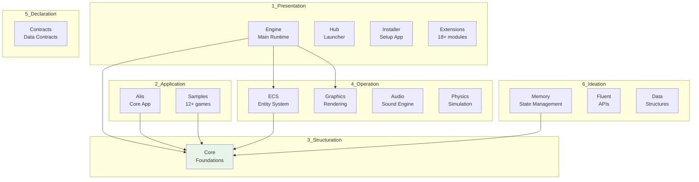
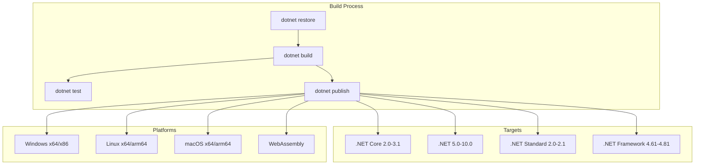

# Architecture Diagrams

Mermaid diagrams illustrating the Alis solution architecture.

## Layer Dependency Flow

## Build System Flow

## Dependency Graph

| Layer | Dependencies | Direction |
|-------|--------------|-----------|
| 1_Presentation | 3_Structuration, 4_Operation, 5_Declaration, 6_Ideation | ✅ Valid |
| 2_Application | 3_Structuration, 4_Operation | ✅ Valid |
| 3_Structuration | None (Base Layer) | ✅ Valid |
| 4_Operation | 3_Structuration, 5_Declaration | ✅ Valid |
| 5_Declaration | 3_Structuration | ✅ Valid |
| 6_Ideation | 3_Structuration, 5_Declaration | ✅ Valid |

## See Also
- [[Repository Overview]]
- [[Dependency Graph]]
- [[Build System]]
