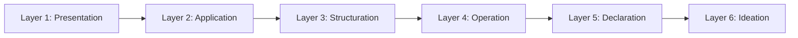
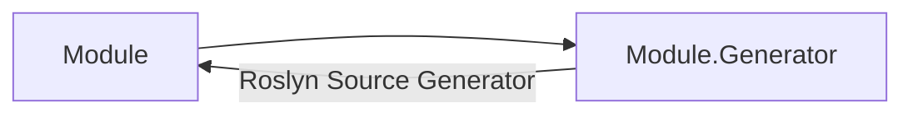

# Architecture Overview

## 6-Layer Clean Architecture

```mermaid
graph TD
    subgraph "Layer 1: Presentation"
        Engine[Alis.App.Engine]
        Hub[Alis.App.Hub]
        Installer[Alis.App.Installer]
        Benchmark[Alis.Benchmark]
        Extensions[Extensions*]
    end
    
    subgraph "Layer 2: Application"
        Main[Alis (Main)]
    end
    
    subgraph "Layer 3: Structuration"
        Core[Alis.Core]
    end
    
    subgraph "Layer 4: Operation"
        ECS[Alis.Core.Ecs]
        Audio[Alis.Core.Audio]
        Graphic[Alis.Core.Graphic]
        Physic[Alis.Core.Physic]
    end
    
    subgraph "Layer 5: Declaration"
        Aspect[Alis.Core.Aspect]
    end
    
    subgraph "Layer 6: Ideation"
        Data[Alis.Core.Aspect.Data]
        Fluent[Alis.Core.Aspect.Fluent]
        Logging[Alis.Core.Aspect.Logging]
        Math[Alis.Core.Aspect.Math]
        Memory[Alis.Core.Aspect.Memory]
        Time[Alis.Core.Aspect.Time]
    end
    
    Engine --> Main
    Hub --> Main
    Installer --> Main
    Benchmark --> Main
    
    Main --> Core
    
    Core --> ECS
    Core --> Audio
    Core --> Graphic
    Core --> Physic
    
    ECS --> Aspect
    Audio --> Aspect
    Graphic --> Aspect
    Physic --> Aspect
    
    Aspect --> Data
    Aspect --> Fluent
    Aspect --> Logging
    Aspect --> Math
    Aspect --> Memory
    Aspect --> Time
```

## Dependency Flow

Dependencies flow strictly downward:



## Build Modes

### Debug Mode
- Standard MSBuild ProjectReference chain
- Each layer references the next layer down explicitly
- Generator projects referenced as analyzers

### Release Mode
- **Source file merging**: Source files from lower layers are compiled directly into higher-layer assemblies via `<Compile Include="...">`
- **Link strategy**: Files are linked with relative path rewrites
- **Single assembly output**: Enables producing a single merged assembly

## Generator Pattern

Each module has a paired generator project:



## Key Design Decisions

1. **Aspect-First Design**: All cross-cutting concerns are defined in Layer 6 (Ideation) and consumed upward
2. **ECS for Game Logic**: Entity-Component System separates data (components) from behavior (systems)
3. **Pluggable Graphics Backends**: SDL2, SFML, GLFW implementations via common interfaces
4. **Multi-Framework Support**: Builds for 15+ .NET frameworks from the same codebase
5. **Source Generators for Code Gen**: 14 Roslyn generators reduce boilerplate

## Related

- [[Repository Overview]]
- [[Projects Index]]
- [[Dependency Index]]
- [[Architecture Rules]]
- [[Technology Stack]]
