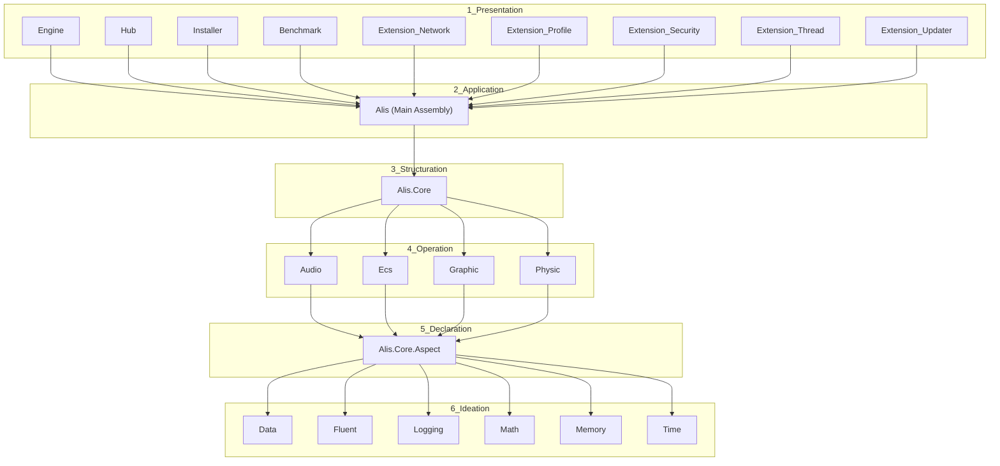
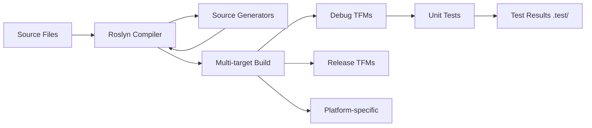

# Architecture Overview

## 6-Layer Architecture

Alis enforces a strict 6-layer dependency architecture via MSBuild configuration.



## Dependency Flow

Each layer can only reference the layer immediately below it (and transitively, all layers below).

```
Presentation (apps, extensions)
    ↓
Application (main Alis assembly)
    ↓
Structuration (Core abstractions)
    ↓
Operation (Audio, ECS, Graphics, Physics)
    ↓
Declaration (Aspect contracts)
    ↓
Ideation (Data, Math, Memory, Time, Logging, Fluent)
```

## Source Generator Flow

Source generators (netstandard2.0 analyzers) are referenced from higher layers down:

```
Presentation → all generators
Application → generators from layers 3-6
Structuration → generators from layers 4-6
Operation → generators from layers 5-6
Declaration → generators from layer 6
```

## Project Template Pattern

Every module follows the same structure:

```
<module>/
├── generator/     (Roslyn source generator, netstandard2.0)
├── sample/        (usage example project)
├── src/           (main library source)
└── test/          (xUnit test project)
```

## Build Pipeline



## Architectural Constraints

1. **No reverse layer dependencies** - enforced by MSBuild Config.props
2. **No external NuGet dependencies in core** - only SourceLink
3. **No LINQ in hot paths**
4. **No boxing, reflection, runtime emit in hot paths**
5. **AOT compatibility required** - no Reflection.Emit
6. **Prefer Span<T>, SIMD, data-oriented design**
7. **Expression-bodied members preferred**
8. **No `var` for built-in types**
9. **No comments** - only XML doc comments
10. **Block-scoped namespaces**

## Related Documents

- [[repository-overview]]
- [[dependency-graph]]
- [[source-generator-architecture]]
- [[multi-targeting-strategy]]
- [[build-pipeline]]
