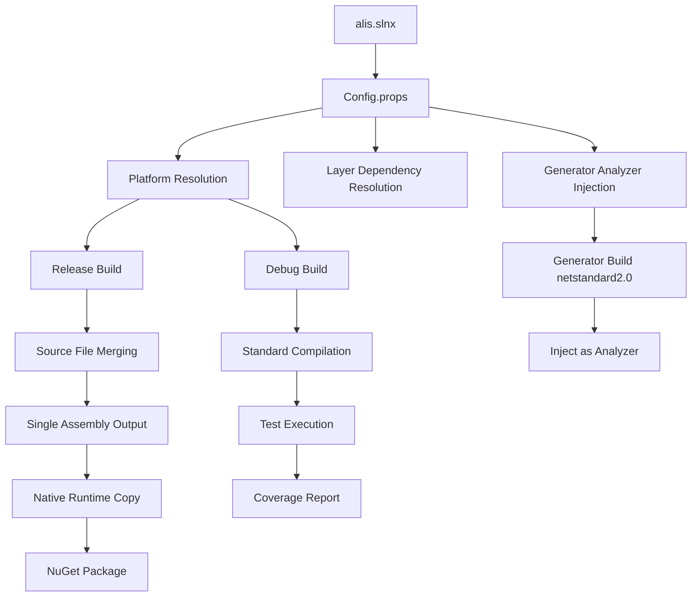

# Build System

## Overview

The Alis build system uses MSBuild with a sophisticated shared configuration system.

## Configuration Files

| File | Purpose |
|---|---|
| `Directory.Build.props` | Root-level properties for all projects |
| `.config/Config.props` | Shared multi-layer build configuration (777 lines) |
| `.config/target/alis.targets` | MSBuild targets for NuGet packaging |
| `.config/coverlet.runsettings` | Code coverage configuration |
| `.config/xunit.runner.json` | Test runner configuration |
| `.config/SonarQube.Analysis.xml` | SonarQube static analysis config |
| `global.json` | .NET SDK version pinning |
| `NuGet.Config` | NuGet package sources |

## Solution Files

| Solution | Purpose |
|---|---|
| `alis.slnx` | Main solution (all projects, 2847 lines) |
| `alis_design.sln` | Design-time solution for IDE performance |
| `alis.core.slnx` | Core projects only |
| `alis.extensions.slnx` | Extension projects only |
| `alis.apps.slnx` | Application projects only |
| `alis.test.slnx` | Test projects only |
| `alis.benchmark.slnx` | Benchmark projects |
| `alis.samples.slnx` | Sample projects |
| `alis.core.aspect.slnx` | Aspect-oriented core projects |

## Build Modes

### Debug Mode
```bash
dotnet build alis.slnx -c Debug
```
- Standard multi-project build
- Each project compiles independently
- Debug symbols generated
- Test frameworks available

### Release Mode
```bash
dotnet build alis.slnx -c Release
```
- Source file merging across layers
- Single-assembly output per layer
- Optimized for NuGet packaging
- AOT-ready compilation
- SonarQube analysis support

## Multi-Target Build

Debug mode targets 6 frameworks:
```
netcoreapp2.0;net5.0;net8.0;net10.0;netstandard2.0;net461
```

Release mode targets 19+ frameworks including all modern, legacy, and platform-specific TFMs.

## Platform-Specific Build

Runtime Identifiers supported:
- `win-x64`, `win-x86`, `win-arm`
- `osx-x64`, `osx-arm64`
- `linux-x64`, `linux-arm64`, `linux-arm`
- `browser-wasm`
- `android-arm64`, `android-x64`
- `ios-arm64`, `iossimulator-arm64`, `iossimulator-x64`

## Build Process Flow



## Asset Packing

The build system includes an asset packing pipeline:
1. Detects `Assets/` directory in projects
2. Generates SHA-256 file manifest
3. Zips assets to `obj/assets.zip`
4. Converts to Base64 (`obj/assets.pack`)
5. Embeds in assembly as `AdditionalFiles`

## Test Configuration

- Tests run via `dotnet test`
- Results in TRX format at `.test/<TargetFramework>/`
- Coverage via coverlet with custom runsettings
- Test projects auto-include via naming convention

## Related

- [[Config.props]]
- [[Build Targets]]
- [[Architecture Overview]]
- [[Repository Overview]]
