## Layer Dependencies (Mermaid)

```mermaid
graph TD
    subgraph "1_Presentation"
        A1[Alis.App.Engine]
        A2[Alis.App.Hub]
        A3[Alis.App.Installer]
        A4[Alis.Benchmark]
        E1[Alis.Extension.Ads.GoogleAds]
        E2[Alis.Extension.Security]
        E3[Alis.Extension.Payment.Stripe]
        E4[Alis.Extension.Network]
        E5[Alis.Extension.Io.FileDialog]
        E6[Alis.Extension.Updater]
        E7[Alis.Extension.Language.Translator]
        E8[Alis.Extension.Language.Dialogue]
        E9[Alis.Extension.Math.ProceduralDungeon]
        E10[Alis.Extension.Math.HighSpeedPriorityQueue]
        E11[Alis.Extension.Graphic.Ui]
        E12[Alis.Extension.Graphic.Sfml]
        E13[Alis.Extension.Graphic.Glfw]
        E14[Alis.Extension.Graphic.Sdl2]
        E15[Alis.Extension.Profile]
        E16[Alis.Extension.Cloud.DropBox]
        E17[Alis.Extension.Cloud.GoogleDrive]
        E18[Alis.Extension.Thread]
        E19[Alis.Extension.Media.FFmpeg]
    end

    subgraph "2_Application"
        B1[Alis.App.Core]
        B2[Alis.Sample.Flappy.Bird]
        B3[Alis.Sample.Pong]
        B4[Alis.Sample.Dino]
        B5[Alis.Sample.Space.Simulator]
        B6[Alis.Sample.King.Platform]
        B7[Alis.Sample.Empty]
        B8[Alis.Sample.SplitCamera]
        B9[Alis.Sample.Asteroid]
        B10[Alis.Sample.Rogue]
        B11[Alis.Sample.Snake]
        B12[Alis.Sample.RuinsOfTartarus]
        B13[Alis.Sample.Egg]
        B14[Alis.Sample.Inefable]
    end

    subgraph "3_Structuration"
        C1[Alis.Core]
        C2[Alis.Core.Ecs]
        C3[Alis.Core.Graphic]
        C4[Alis.Core.Audio]
        C5[Alis.Core.Physic]
    end

    subgraph "4_Operation"
        D1[Alis.Core.Ecs]
        D2[Alis.Core.Graphic]
        D3[Alis.Core.Audio]
        D4[Alis.Core.Physic]
    end

    subgraph "5_Declaration"
        F1[Alis.Core.Aspect]
    end

    subgraph "6_Ideation"
        G1[Alis.Core.Aspect.Memory]
        G2[Alis.Core.Aspect.Fluent]
        G3[Alis.Core.Aspect.Math]
        G4[Alis.Core.Aspect.Time]
        G5[Alis.Core.Aspect.Data]
        G6[Alis.Core.Aspect.Logging]
    end

    %% Layer dependencies
    A1 --> B1
    A2 --> B1
    A3 --> B1
    E1 --> B1
    E2 --> B1
    E3 --> B1
    E4 --> B1
    E5 --> B1
    E6 --> B1
    E7 --> B1
    E8 --> B1
    E9 --> B1
    E10 --> B1
    E11 --> C3
    E12 --> C3
    E13 --> C3
    E14 --> C3
    E15 --> B1
    E16 --> B1
    E17 --> B1
    E18 --> B1
    E19 --> B1

    B2 --> C1
    B3 --> C1
    B4 --> C1
    B5 --> C1
    B6 --> C1
    B7 --> C1
    B8 --> C1
    B9 --> C1
    B10 --> C1
    B11 --> C1
    B12 --> C1
    B13 --> C1
    B14 --> C1

    C1 --> D1
    C1 --> D2
    C1 --> D3
    C1 --> D4

    D1 --> F1
    D2 --> F1
    D3 --> F1
    D4 --> F1

    G1 --> F1
    G2 --> F1
    G3 --> F1
    G4 --> F1
    G5 --> F1
    G6 --> F1

    %% Generator dependencies
    D1.Generator --> F1
    D2.Generator --> F1
    G1.Generator --> F1
    G2.Generator --> F1
    G5.Generator --> F1
```



## Dependency Flow Rules

### Allowed Dependencies
| From Layer | To Layer | Rule |
|------------|----------|------|
| 1_Presentation | 2_Application | ✅ Direct reference |
| 2_Application | 3_Structuration | ✅ Direct reference |
| 3_Structuration | 4_Operation | ✅ Direct reference |
| 4_Operation | 5_Declaration | ✅ Direct reference |
| 5_Declaration | 6_Ideation | ✅ Direct reference |
| 6_Ideation | 5_Declaration | ✅ Generator output |

### Forbidden Dependencies
| From Layer | To Layer | Rule |
|------------|----------|------|
| Any | Any above it | ❌ No upward references |
| Any | Non-adjacent layer | ❌ No cross-layer references |
| 6_Ideation | 4_Operation+ | ❌ Generators only output to Declaration |

## Extension Dependency Map

| Extension | Depends On | Purpose |
|-----------|-----------|---------|
| Ads.GoogleAds | 2_Application | Google AdMob integration |
| Security | 2_Application | Security/encryption utilities |
| Payment.Stripe | 2_Application | Stripe payment integration |
| Network | 2_Application | Networking abstractions |
| Io.FileDialog | 2_Application | Cross-platform file dialogs |
| Updater | 2_Application | Application update mechanism |
| Language.Translator | 2_Application | Translation/localization |
| Language.Dialogue | 2_Application | Dialogue system |
| Math.ProceduralDungeon | 2_Application | Procedural dungeon generation |
| Math.HighSpeedPriorityQueue | 2_Application | Optimized priority queue |
| Graphic.Ui | 3_Structuration (Graphic) | UI framework |
| Graphic.Sfml | 3_Structuration (Graphic) | SFML graphics backend |
| Graphic.Glfw | 3_Structuration (Graphic) | GLFW windowing backend |
| Graphic.Sdl2 | 3_Structuration (Graphic) | SDL2 windowing backend |
| Profile | 2_Application | Performance profiling |
| Cloud.DropBox | 2_Application | Dropbox cloud storage |
| Cloud.GoogleDrive | 2_Application | Google Drive cloud storage |
| Thread | 2_Application | Threading utilities |
| Media.FFmpeg | 2_Application | FFmpeg media processing |

## Generator Cascade

```
Alis.Core.Aspect.Memory.Generator → Alis.Core.Aspect (Declaration)
Alis.Core.Aspect.Fluent.Generator → Alis.Core.Aspect (Declaration)
Alis.Core.Aspect.Data.Generator → Alis.Core.Aspect (Declaration)
Alis.Core.Ecs.Generator → Alis.Core.Ecs (Operation)
Alis.Core.Graphic.Generator → Alis.Core.Graphic (Operation)
```

Each generator project:
1. References its target layer project
2. Uses Roslyn `ISourceGenerator` interface
3. Outputs generated `.cs` files into the target project
4. May have its own test and sample projects

## Related

- [[dependency-index]] — Dependency index with Mermaid
- [[diagrams/dependency-graph]] — Visual dependency diagram
- [[dependencies/dependency-graph]] — Raw dependency data
- [[architecture-overview]] — Full architecture diagrams
- [[adr-001-layered-architecture]] — Layer dependency rules
- [[adr-002-aggregator-pattern]] — Aggregator reference pattern
- [[layer-index]] — Layer-by-layer breakdown
- [[project-index]] — All projects indexed
- [[Generator Pattern]] — Generator architecture
- [[Layered Architecture]] — Layer structure details
