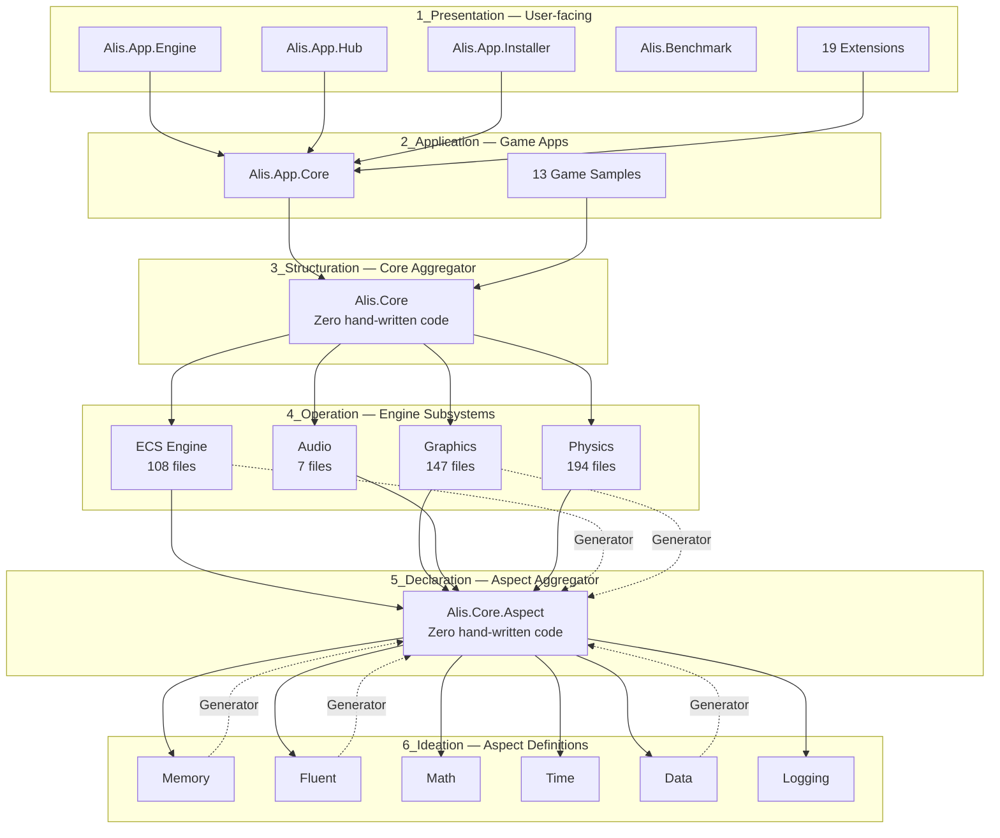

## Executive Summary

**ALIS** is a comprehensive cross-platform game engine framework written in C# with **140+ projects** organized into **6 architectural layers**. It features an Entity Component System (ECS), aspect-oriented programming via source generators, and targets 15+ .NET frameworks across Windows, macOS, Linux, and WebAssembly.

**Author**: Pablo Perdomo Falcón | **License**: GPLv3 | **Version**: 1.0.6 | **SDK**: .NET 10.0+

## Architecture: Six-Layer Screaming Architecture



## Dependency Flow (Strict — Never Reverse)

```
1_Presentation → 2_Application → 3_Structuration → 4_Operation → 5_Declaration ← 6_Ideation
```

- **Upward references are forbidden**
- **Source generators cascade**: 6_Ideation → 5_Declaration → 4_Operation → 3_Structuration → 2_Application → 1_Presentation
- **Aggregator projects** (Alis.Core, Alis.Core.Aspect) contain zero hand-written code — they re-export types

## Layer Breakdown

### Layer 1: Presentation (1_Presentation) — ~60 projects

User-facing applications and extensions:

| Project | Type | Description |
|---------|------|-------------|
| Alis.App.Engine | Application | Main game engine/editor |
| Alis.App.Hub | Application | Project management hub |
| Alis.App.Installer | Application | Installation wizard |
| Alis.Benchmark | Benchmark | Performance benchmarking |

**Extensions** (19):

| Extension | Category | Description |
|-----------|----------|-------------|
| Alis.Extension.Ads.GoogleAds | Ads | Google Ads integration |
| Alis.Extension.Security | Security | Encryption and auth utilities |
| Alis.Extension.Payment.Stripe | Payment | Stripe payment processing |
| Alis.Extension.Network | Network | TCP/UDP networking with buffer pooling |
| Alis.Extension.Io.FileDialog | I/O | Native file dialog |
| Alis.Extension.Updater | System | Application self-updater |
| Alis.Extension.Language.Translator | Language | Multi-language translation |
| Alis.Extension.Language.Dialogue | Language | NPC dialogue system |
| Alis.Extension.Math.ProceduralDungeon | Math | Procedural dungeon generation |
| Alis.Extension.Math.HighSpeedPriorityQueue | Math | Lock-free priority queue |
| Alis.Extension.Graphic.Ui | Graphics | ImGui-based UI system |
| Alis.Extension.Graphic.Sfml | Graphics | SFML graphics backend |
| Alis.Extension.Graphic.Glfw | Graphics | GLFW window/input backend |
| Alis.Extension.Graphic.Sdl2 | Graphics | SDL2 graphics/audio backend |
| Alis.Extension.Profile | System | User profile management |
| Alis.Extension.Cloud.DropBox | Cloud | Dropbox cloud storage |
| Alis.Extension.Cloud.GoogleDrive | Cloud | Google Drive cloud storage |
| Alis.Extension.Thread | System | Managed thread pool |
| Alis.Extension.Media.FFmpeg | Media | FFmpeg video/audio processing |

### Layer 2: Application (2_Application) — ~30 projects

Core application framework and game samples:

| Project | Type | Platforms |
|---------|------|-----------|
| Alis | Core App | All |
| Alis.Sample.Flappy.Bird | Game | Desktop, Web |
| Alis.Sample.Pong | Game | Desktop, Web |
| Alis.Sample.Dino | Game | Desktop, Web |
| Alis.Sample.Space.Simulator | Game | Desktop, Web |
| Alis.Sample.King.Platform | Game | Desktop, Web |
| Alis.Sample.SplitCamera | Game | Desktop, Web |
| Alis.Sample.Asteroid | Game | Desktop, Web, iOS, Android |
| Alis.Sample.Rogue | Game | Desktop, Web |
| Alis.Sample.Snake | Game | Desktop, Web |
| Alis.Sample.RuinsOfTartarus | Game | Desktop, Web |
| Alis.Sample.Egg | Game | Desktop, Web |
| Alis.Sample.Inefable | Game | Desktop, Web |
| Alis.Sample.Empty | Game | Desktop, Web |

### Layer 3: Structuration (3_Structuration) — 3 projects

Core engine aggregator (zero hand-written code):

| Project | Purpose |
|---------|---------|
| Alis.Core | Re-exports all 4_Operation types |
| Alis.Core.Test | Tests |
| Alis.Core.Sample | Sample usage |

### Layer 4: Operation (4_Operation) — 14 projects

Engine subsystems (each with src/test/sample/Generator):

| Subsystem | Source Files | Description |
|-----------|-------------|-------------|
| Alis.Core.Ecs | ~108 | Entity Component System |
| Alis.Core.Graphic | ~147 | Graphics rendering engine |
| Alis.Core.Audio | ~7 | Cross-platform audio |
| Alis.Core.Physic | ~194 | 2D physics engine |

### Layer 5: Declaration (5_Declaration) — 3 projects

Aspect system aggregator (zero hand-written code):

| Project | Purpose |
|---------|---------|
| Alis.Core.Aspect | Re-exports all 6_Ideation types |
| Alis.Core.Aspect.Test | Tests |
| Alis.Core.Aspect.Sample | Sample usage |

### Layer 6: Ideation (6_Ideation) — ~24 projects

Aspect definitions with source generators (each with src/test/sample/Generator):

| Aspect | Source Files | Purpose |
|--------|-------------|---------|
| Alis.Core.Aspect.Memory | ~3 | ZIP-based asset management with dual-cache |
| Alis.Core.Aspect.Fluent | ~128 | Fluent builder API (120+ marker interfaces) |
| Alis.Core.Aspect.Data | ~18 | Custom JSON parser (AOT-compatible) |
| Alis.Core.Aspect.Math | ~29 | Value-type vectors, matrices, shapes |
| Alis.Core.Aspect.Time | ~1 | High-resolution clock |
| Alis.Core.Aspect.Logging | ~24 | Structured logging with pluggable pipeline |

## Technology Stack

| Aspect | Technology |
|--------|-----------|
| Language | C# 13 |
| Runtime | .NET 10.0+ (SDK), targeting netcoreapp2.0–net10.0, netstandard2.0–2.1, net461–481 |
| Architecture | ECS + AOP + Layered |
| Serialization | Custom JSON parser (AOT-compatible) |
| Math | Value types with StructLayout(Pack=1) |
| Testing | xUnit + Moq |
| Code Analysis | SonarQube + .NET Analyzers (AllEnabledByDefault) |
| Source Link | Microsoft.SourceLink.GitHub |
| CI/CD | GitHub Actions (41 workflows) |
| Platforms | Windows, macOS, Linux, WebAssembly, (Android/iOS planned) |
| Native Bindings | SFML, GLFW, SDL2, OpenGL |

## Key Architectural Patterns

1. **ECS (Entity Component System)** — Core game object management with archetype-based storage
2. **AOP (Aspect-Oriented Programming)** — Cross-cutting concerns via source generators
3. **Screaming Architecture** — Directory structure reveals intent
4. **Aggregator Pattern** — Zero-code re-export projects reduce reference chains
5. **Source Generator Cascading** — Generators in 6_Ideation produce code flowing through all layers
6. **Value-Type Performance** — Heavy use of structs, Span<T>, Memory<T> for zero GC pressure
7. **AOT Compatibility** — No reflection at runtime, source generators for compile-time code

## Build System

```bash
dotnet restore                    # Restore all dependencies
dotnet build alis.slnx            # Build all projects (Debug)
dotnet test alis.slnx             # Run all tests
dotnet pack -c Release            # Create NuGet packages
```

See [[architecture/build-system]] for detailed build configuration.

## Documentation Status

| Layer | Projects | Documented | Coverage |
|-------|----------|------------|----------|
| 6_Ideation | ~24 | 6 | 25% |
| 4_Operation | ~14 | 4 | 29% |
| 1_Presentation | ~60 | 8 | 13% |
| 3_Structuration | ~3 | 0 | 0% |
| 2_Application | ~30 | 0 | 0% |
| 5_Declaration | ~3 | 0 | 0% |
| **Total** | **~140** | **~18** | **~13%** |

## Related Documentation

- [[system/indexes/projects-index]] — Complete project inventory
- [[system/indexes/dependency-index]] — Dependency relationships
- [[architecture/dependency-graph]] — Visual dependency maps
- [[decisions/adr-001-layered-architecture]] — Architecture decision record
- [[decisions/adr-002-aggregator-pattern]] — Aggregator pattern decision
