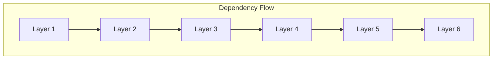

# Layered Architecture Concept

## Overview

Alis uses a strict 6-layer clean architecture pattern where each layer has a specific responsibility and dependencies flow only downward.

## Layer Definitions

| Layer | Name | Responsibility |
|---|---|---|
| 1 | **Presentation** | User-facing applications, extensions, UI |
| 2 | **Application** | Application composition and orchestration |
| 3 | **Structuration** | Core bridging between layers |
| 4 | **Operation** | Runtime game systems |
| 5 | **Declaration** | Aspect-oriented contracts |
| 6 | **Ideation** | Foundational utility modules |

## Dependency Direction

## Rules

1. **Strict Top-Down**: Dependencies flow from Layer 1 down to Layer 6
2. **No Skipping**: Each layer depends only on the adjacent layer below
3. **No Reverse Dependencies**: Lower layers never reference higher layers
4. **Build Enforcement**: MSBuild conditionals enforce these rules

## Build Time vs Runtime

### Debug Mode
- Standard assembly boundaries between layers
- Each layer compiles to its own assembly
- Layer dependencies enforced via `ProjectReference`

### Release Mode
- Source files from lower layers compiled into higher-layer assemblies
- Single assembly per distribution unit
- Layer boundaries exist logically but not physically

## Benefits

- Clear separation of concerns
- Testable isolation
- Independent deployability
- Reduced coupling
- Clear ownership boundaries

## Related

- [[Architecture Overview]]
- [[Architecture Rules]]
- [[Build System]]
- [[6-Layer Diagram]]
