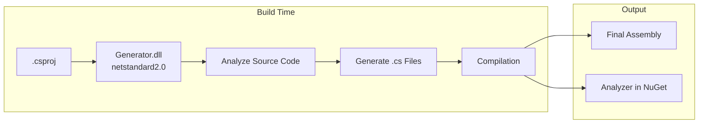

# Source Generators Concept

## Overview

Roslyn source generators are used extensively in Alis to produce boilerplate code at compile time, eliminating runtime reflection and improving performance.

## Architecture



## Generator Projects

All 12 generators follow the same pattern:

| Generator | Generated Code |
|---|---|
| Alis.Generator | Application-level boilerplate |
| Alis.Core.Generator | Core structuration code |
| Alis.Core.Ecs.Generator | ECS component/system registration |
| Alis.Core.Audio.Generator | Audio module code |
| Alis.Core.Graphic.Generator | Graphics module code |
| Alis.Core.Physic.Generator | Physics module code |
| Alis.Core.Aspect.Data.Generator | Serialization code |
| Alis.Core.Aspect.Fluent.Generator | Builder pattern code |
| Alis.Core.Aspect.Logging.Generator | Logger code |
| Alis.Core.Aspect.Math.Generator | Math utility code |
| Alis.Core.Aspect.Memory.Generator | Memory management code |
| Alis.Core.Aspect.Time.Generator | Time-related code |

## AOT Compatibility

Source generators are critical for AOT (Ahead-of-Time) compilation:
- No `System.Reflection.Emit`
- No runtime code generation
- All code is determined at compile time
- Trimmer-friendly output

## Build Integration

```xml
<ProjectReference Include="...Generator.csproj"
    OutputItemType="Analyzer"
    PrivateAssets="all"
    ReferenceOutputAssembly="false">
    <Properties>TargetFramework=netstandard2.0</Properties>
</ProjectReference>
```

## Related

- [[Generators]]
- [[Aspect-Oriented Design]]
- [[Build System]]
- [[Performance Overview]]
