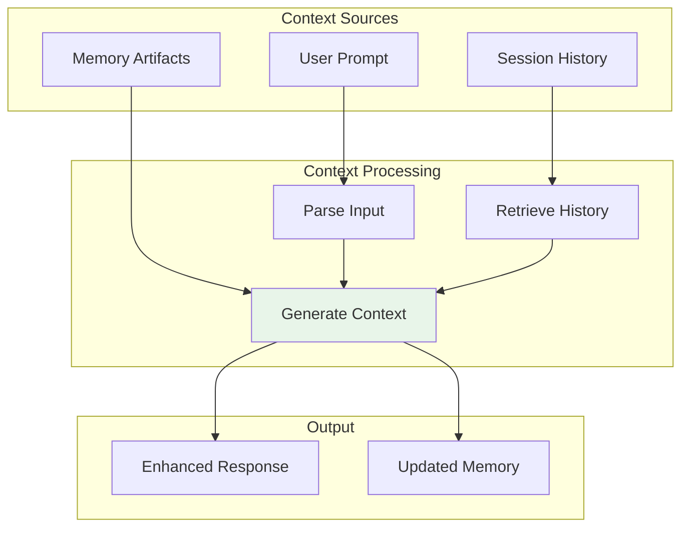

# Context Management

Diagrams illustrating context handling and state management.

## Context Flow

## Context Categories

| Category | Description | Status |
|----------|-------------|--------|
| User Prompt | Current request context | ✅ Active |
| Session History | Previous session data | ✅ Archived |
| Memory Artifacts | Persistent knowledge | ✅ Indexed |

## See Also
- [[Onboarding]]
- [[Project Map]]
