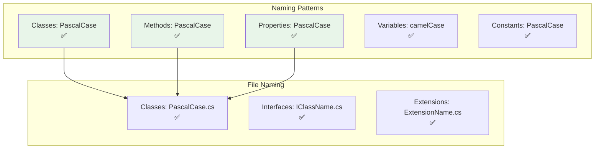

# Naming Conventions

Diagrams illustrating naming patterns and coding standards.

## Naming Convention Flow

## Coding Standards

| Standard | Status | Description |
|----------|--------|-------------|
| XML Documentation | ✅ Required | All public APIs |
| No Inline Comments | ✅ Enforced | Only XML docs |
| C# 13 Features | ✅ Used | Modern syntax |
| Multi-Targeting | ✅ Required | 15+ frameworks |

## Dependency Constraints

| Constraint | Status |
|------------|--------|
| Layer Order | ✅ Enforced |
| No External NuGet | ✅ Verified |
| AOT Compatibility | ✅ Checked |

## See Also
- [[Coding Conventions]]
- [[Dependency Constraints]]
