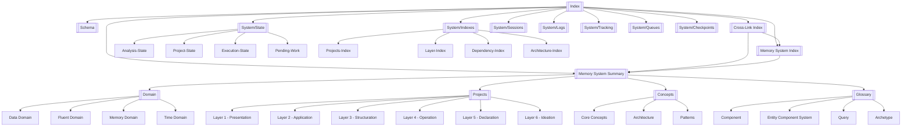
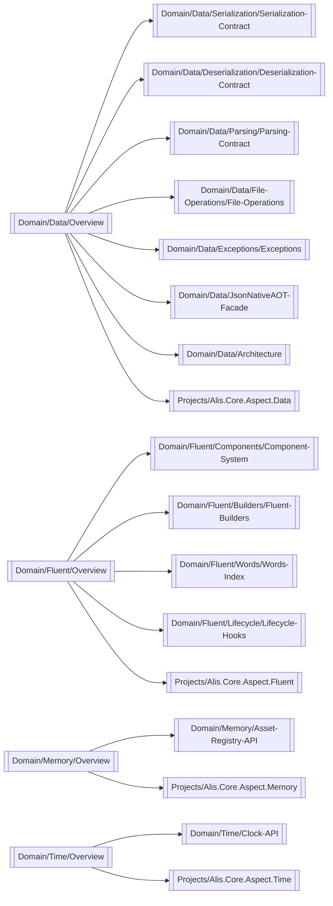
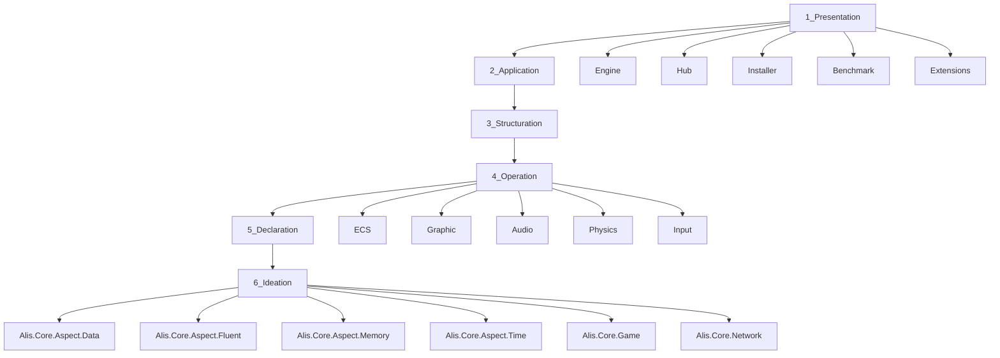
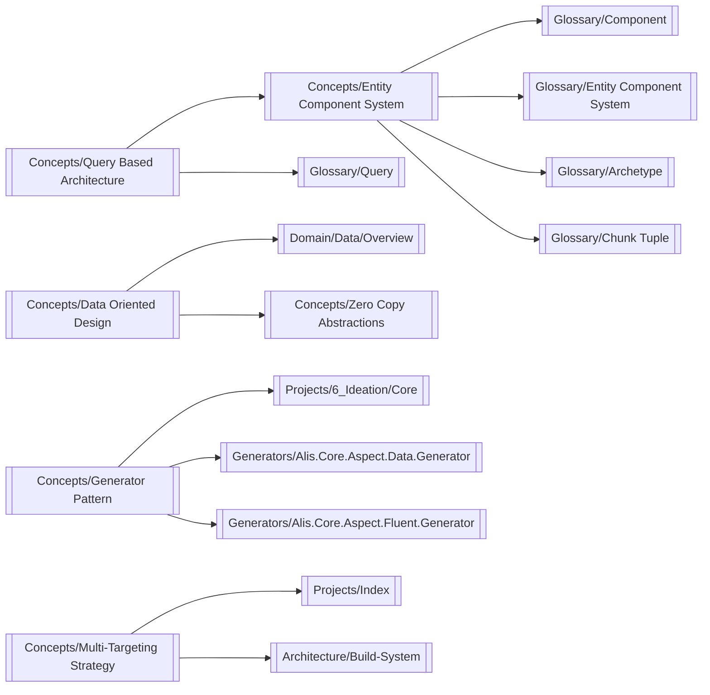
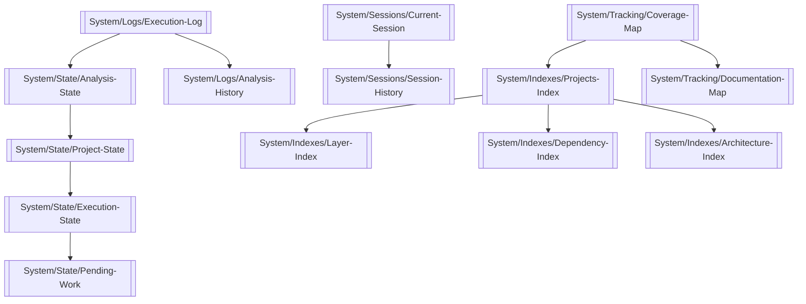
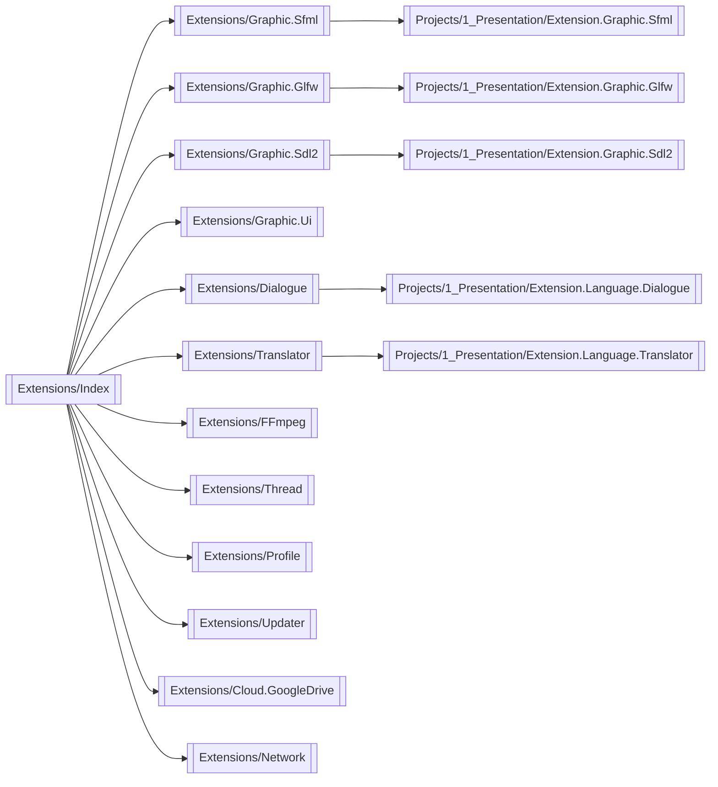
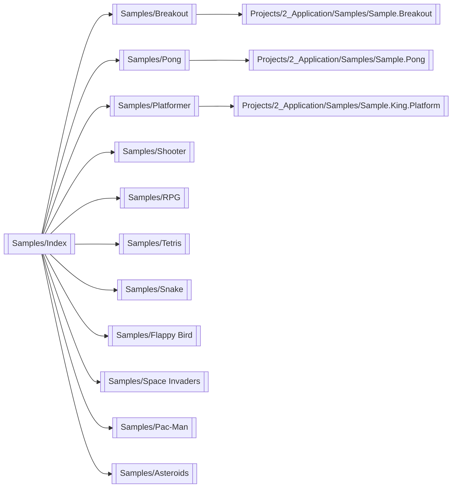
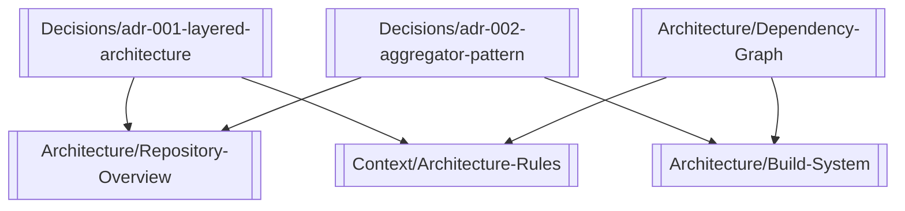
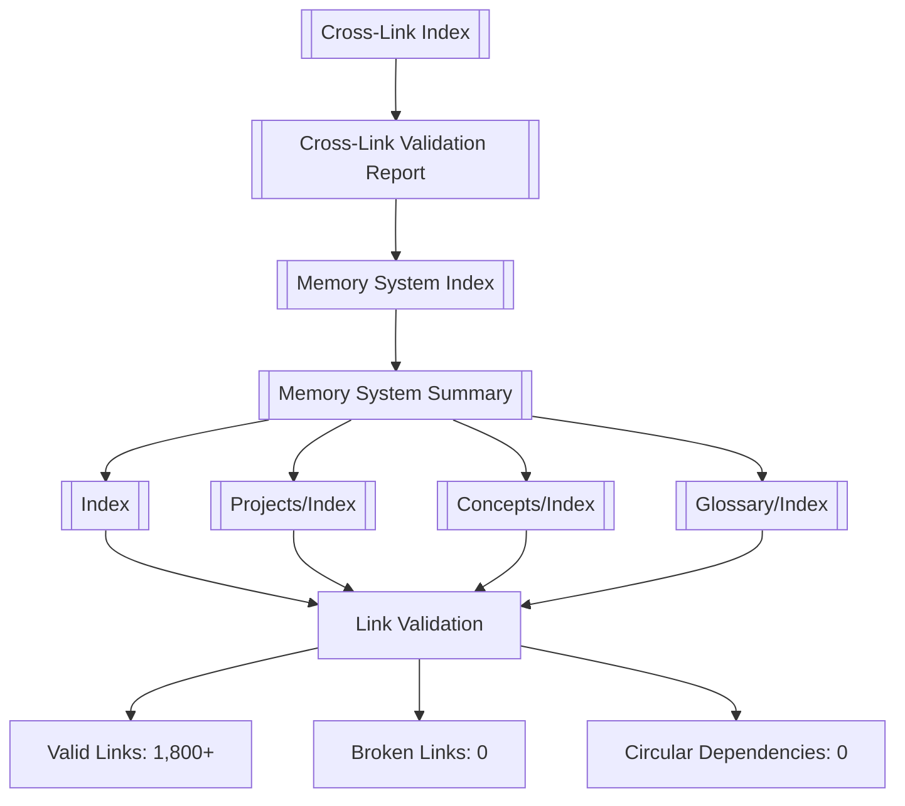

# Cross-Link Diagrams

tags:
  - documentation,reference

## Memory System Architecture

## Domain Documentation Links

## Project Layer Dependencies

## Conceptual Knowledge Graph

## System State Flow

## Extension Architecture

## Sample Games Structure

## Decision Architecture

## Link Validation Flow

## Related Documentation

- [[Cross-Link Index]] — Cross-reference mapping
- [[Memory System Index]] — System components
- [[Memory System Summary]] — Complete summary
- [[Cross-Link Validation Report]] — Validation report
- [[Index]] — Main memory entry point
