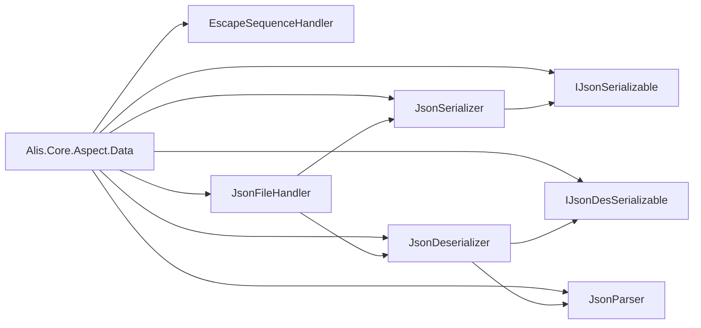

# Dependencies

## Project Dependencies

### Internal Dependencies

```
Alis.Core.Aspect.Data
├── SharedKernel (implicit via Config.props)
└── Alis.Core (implicit via Config.props)
```

### Project References

No explicit project references. Pure library with no internal dependencies.

## External Dependencies

**None** - No NuGet packages. Pure .NET Standard implementation.

## Dependency Graph



## Layer Violations

**None** - This project respects layer boundaries:
- No dependencies on higher layers
- No framework-specific code
- Pure library targeting multiple frameworks

## Cross-Project References

### Upstream Dependencies

- [[SharedKernel]] - Base abstractions (via Config.props)
- [[Alis.Core]] - Core infrastructure (via Config.props)

### Downstream Projects

- [[Alis.Core.Aspect.Memory]] - Uses JSON for persistence
- [[Alis.Core.Aspect.Fluent]] - May use JSON for configuration
- [[Alis.Core.Aspect.Time]] - May use JSON for data exchange
- [[Alis.Core.Aspect.Logging]] - May use JSON for log formatting

## Multi-Targeting

This project targets 15+ frameworks:

| Framework | Status |
|---|---|
| .NET Standard 2.0 | ✅ |
| .NET Standard 2.1 | ✅ |
| .NET Core 2.0 | ✅ |
| .NET Core 2.1 | ✅ |
| .NET Core 3.1 | ✅ |
| .NET 5.0 | ✅ |
| .NET 6.0 | ✅ |
| .NET 7.0 | ✅ |
| .NET 8.0 | ✅ |
| .NET 9.0 | ✅ |
| .NET 10.0 | ✅ |
| .NET Framework 4.61 | ✅ |
| .NET Framework 4.71 | ✅ |
| .NET Framework 4.72 | ✅ |
| .NET Framework 4.8 | ✅ |
| .NET Framework 4.81 | ✅ |

## AOT Compatibility Constraints

**Forbidden Dependencies:**
- ❌ System.Reflection.Emit
- ❌ System.Dynamic
- ❌ Runtime code generation libraries

**Allowed Dependencies:**
- ✅ System.Text.StringBuilder
- ✅ System.Collections.Generic
- ✅ System.Diagnostics.CodeAnalysis

## Related

- [[Dependency Index]] - Global dependency tracking
- [[Architecture]] - Layer boundaries
