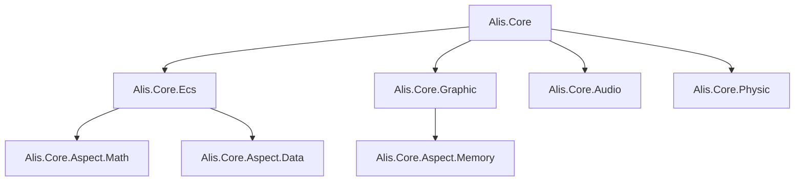
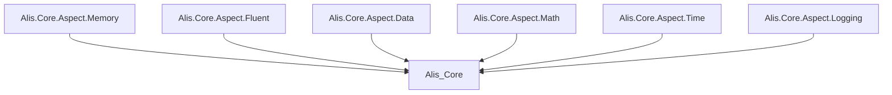
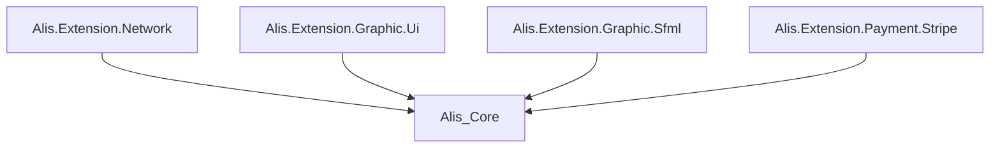
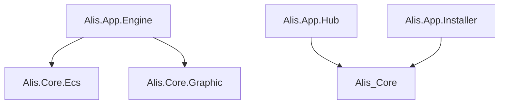

# Dependency Graph

## Project Dependencies

### Core Engine Layer

### Ideation Layer

### Extension Layer

### Application Layer

## Layer Violations

- **None detected** - Architecture appears well-separated

## Cyclic Dependencies

- **None detected** - No circular references found

## Infrastructure Coupling

- Heavy use of platform-specific native bindings in Graphic system
- Memory management dependencies across multiple systems

## Key Dependencies

| Dependency | Type | Usage |
|---|---|---|
| System.Memory | Runtime | Span<T>, Memory<T> for performance |
| System.Runtime.CompilerServices.Unsafe | Runtime | Low-level memory operations |
| SFML/OpenGL | Native | Graphics rendering |
| Platform SDKs | Native | macOS, Windows, Linux support |
