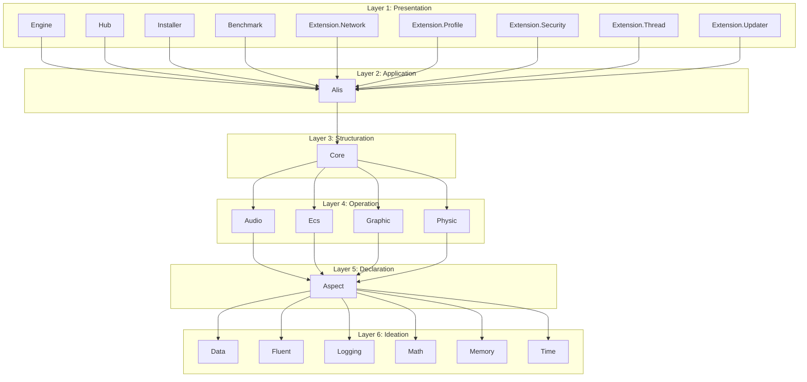

# Dependency Graph

## Layer Dependency Chain


```mermaid
graph TD
    subgraph "Layer 1: Presentation"
        Engine
        Hub
        Installer
        Benchmark
        Ext_Network["Extension.Network"]
        Ext_Profile["Extension.Profile"]
        Ext_Security["Extension.Security"]
        Ext_Thread["Extension.Thread"]
        Ext_Updater["Extension.Updater"]
    end
    
    subgraph "Layer 2: Application"
        Alis
    end
    
    subgraph "Layer 3: Structuration"
        Core
    end
    
    subgraph "Layer 4: Operation"
        Audio
        Ecs
        Graphic
        Physic
    end
    
    subgraph "Layer 5: Declaration"
        Aspect
    end
    
    subgraph "Layer 6: Ideation"
        Data
        Fluent
        Logging
        Math
        Memory
        Time
    end
    
    Engine --> Alis
    Hub --> Alis
    Installer --> Alis
    Benchmark --> Alis
    Ext_Network --> Alis
    Ext_Profile --> Alis
    Ext_Security --> Alis
    Ext_Thread --> Alis
    Ext_Updater --> Alis
    
    Alis --> Core
    
    Core --> Audio
    Core --> Ecs
    Core --> Graphic
    Core --> Physic
    
    Audio --> Aspect
    Ecs --> Aspect
    Graphic --> Aspect
    Physic --> Aspect
    
    Aspect --> Data
    Aspect --> Fluent
    Aspect --> Logging
    Aspect --> Math
    Aspect --> Memory
    Aspect --> Time
```

## Dependency Rules (Enforced by Build)

Each layer may only reference:

| Layer | May Reference |
|---|---|
| 1_Presentation | 2_Application + all generators |
| 2_Application | 3_Structuration + generators from layers 3-6 |
| 3_Structuration | 4_Operation + generators from layers 4-6 |
| 4_Operation | 5_Declaration + generators from layers 5-6 |
| 5_Declaration | 6_Ideation + generators from layer 6 |
| 6_Ideation | Nothing (BCL only) |

## Source Generator Dependency Flow

Generators are consumed as analyzers (not assembly references)

```
Presentation → all generators (layers 2-6)
Application → generators from layers 3-6
Structuration → generators from layers 4-6
Operation → generators from layers 5-6
Declaration → generators from layer 6
```

## External Package Dependencies

| Package | Project | Version |
|---|---|---|
| Microsoft.SourceLink.GitHub | All (Release) | 8.0.0 |
| Stripe.net | Extension.Payment.Stripe | 49.2.0 |
| Google.Ads.Common | Extension.Ads.GoogleAds | 9.5.3 |
| Google.Apis.Drive.v3 | Extension.Cloud.GoogleDrive | 1.68.0.3601 |
| Dropbox.Api | Extension.Cloud.DropBox | 7.0.0 |

## Legacy Compatibility Packages

For net461, netcoreapp2.0, netstandard2.0:
- System.IO.Compression 4.3.0
- System.Net.Http 4.3.0
- System.Runtime.CompilerServices.Unsafe 6.1.1
- System.Memory 4.6.2

## Cyclic Dependency Analysis

**No cyclic dependencies** — the strict 6-layer architecture enforced by MSBuild prevents all cycles.

## Related Documents

- [[architecture-overview]]
- [[layer-architecture]]
- [[project-index]]
