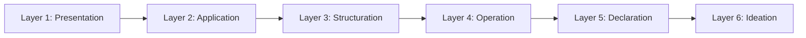

# Dependency Graph

## Layer Dependency Diagram

```mermaid
graph TD
    subgraph "Layer 1: Presentation"
        Engine[Alis.App.Engine]
        Hub[Alis.App.Hub]
        Installer[Alis.App.Installer]
        Benchmark[Alis.Benchmark]
        Ext_Network[Alis.Extension.Network]
        Ext_Security[Alis.Extension.Security]
        Ext_Sdl2[Alis.Extension.Graphic.Sdl2]
        Ext_Sfml[Alis.Extension.Graphic.Sfml]
        Ext_Glfw[Alis.Extension.Graphic.Glfw]
        Ext_Ui[Alis.Extension.Graphic.Ui]
        Ext_FileDialog[Alis.Extension.Io.FileDialog]
        Ext_GoogleDrive[Alis.Extension.Cloud.GoogleDrive]
        Ext_DropBox[Alis.Extension.Cloud.DropBox]
        Ext_Stripe[Alis.Extension.Payment.Stripe]
        Ext_GoogleAds[Alis.Extension.Ads.GoogleAds]
        Ext_Dialogue[Alis.Extension.Language.Dialogue]
        Ext_Translator[Alis.Extension.Language.Translator]
        Ext_PriorityQ[Alis.Extension.Math.HighSpeedPriorityQueue]
        Ext_FFmpeg[Alis.Extension.Media.FFmpeg]
        Ext_Thread[Alis.Extension.Thread]
        Ext_Profile[Alis.Extension.Profile]
        Ext_Updater[Alis.Extension.Updater]
    end
    
    subgraph "Layer 2: Application"
        Alis[Alis]
    end
    
    subgraph "Layer 3: Structuration"
        Core[Alis.Core]
    end
    
    subgraph "Layer 4: Operation"
        ECS[Alis.Core.Ecs]
        Audio[Alis.Core.Audio]
        Graphic[Alis.Core.Graphic]
        Physic[Alis.Core.Physic]
    end
    
    subgraph "Layer 5: Declaration"
        Aspect[Alis.Core.Aspect]
    end
    
    subgraph "Layer 6: Ideation"
        Data[Alis.Core.Aspect.Data]
        Fluent[Alis.Core.Aspect.Fluent]
        Logging[Alis.Core.Aspect.Logging]
        Math[Alis.Core.Aspect.Math]
        Memory[Alis.Core.Aspect.Memory]
        Time[Alis.Core.Aspect.Time]
    end
    
    Engine --> Alis
    Hub --> Alis
    Installer --> Alis
    Benchmark --> Alis
    Ext_Network --> Alis
    Ext_Security --> Alis
    Ext_Sdl2 --> Alis
    Ext_Sfml --> Alis
    Ext_Glfw --> Alis
    Ext_Ui --> Alis
    Ext_FileDialog --> Alis
    Ext_GoogleDrive --> Alis
    Ext_DropBox --> Alis
    Ext_Stripe --> Alis
    Ext_GoogleAds --> Alis
    Ext_Dialogue --> Alis
    Ext_Translator --> Alis
    Ext_PriorityQ --> Alis
    Ext_FFmpeg --> Alis
    Ext_Thread --> Alis
    Ext_Profile --> Alis
    Ext_Updater --> Alis
    
    Alis --> Core
    
    Core --> ECS
    Core --> Audio
    Core --> Graphic
    Core --> Physic
    
    ECS --> Aspect
    Audio --> Aspect
    Graphic --> Aspect
    Physic --> Aspect
    
    ECS --> Memory
    ECS --> Time
    Graphic --> Math
    Physic --> Math
    
    Aspect --> Data
    Aspect --> Fluent
    Aspect --> Logging
    Aspect --> Math
    Aspect --> Memory
    Aspect --> Time
```

## Dependency Rules

```mermaid
flowchart LR
    P1[Layer 1: Presentation] --> P2[Layer 2: Application]
    P2 --> P3[Layer 3: Structuration]
    P3 --> P4[Layer 4: Operation]
    P4 --> P5[Layer 5: Declaration]
    P5 --> P6[Layer 6: Ideation]
```

## Build-Time Dependencies

In **Debug** mode, dependencies are resolved through standard MSBuild ProjectReference:
- Each layer references the layer directly below it
- All layers reference generators from lower layers as analyzers

In **Release** mode, source files from lower layers are compiled directly into higher-layer assemblies.

## Third-Party Dependencies

| NuGet Package | Used By | Version |
|---|---|---|
| Stripe.net | Alis.Extension.Payment.Stripe | 49.2.0 |
| Google.Ads.Common | Alis.Extension.Ads.GoogleAds | 9.5.3 |
| Google.Apis.Drive.v3 | Alis.Extension.Cloud.GoogleDrive | 1.68.0.3601 |
| Dropbox.Api | Alis.Extension.Cloud.DropBox | 7.0.0 |
| System.IO.Compression | Legacy TFMs (net461+) | 4.3.0 |
| System.Net.Http | Legacy TFMs (net461+) | 4.3.0 |
| System.Runtime.CompilerServices.Unsafe | Legacy TFMs (netcoreapp2.0+) | 6.1.1 |
| System.Memory | Legacy TFMs (netcoreapp2.0+) | 4.6.2 |

## Cyclic Dependency Analysis

No cyclic dependencies detected. The strict 6-layer dependency chain prevents cycles.

## Related

- [[Dependency Index]]
- [[Architecture Overview]]
- [[Layer Architecture]]
