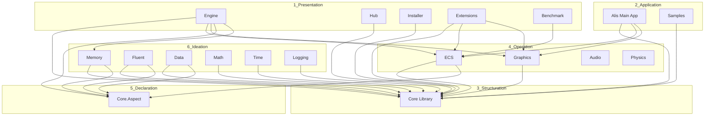
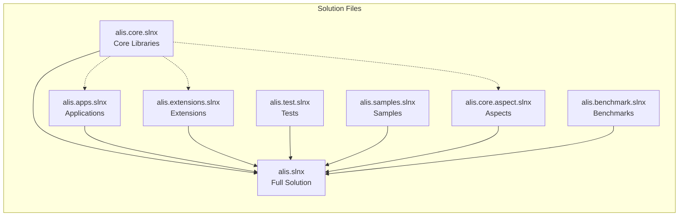
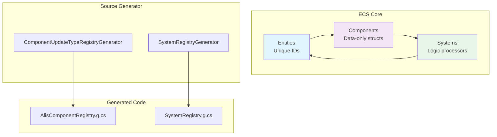
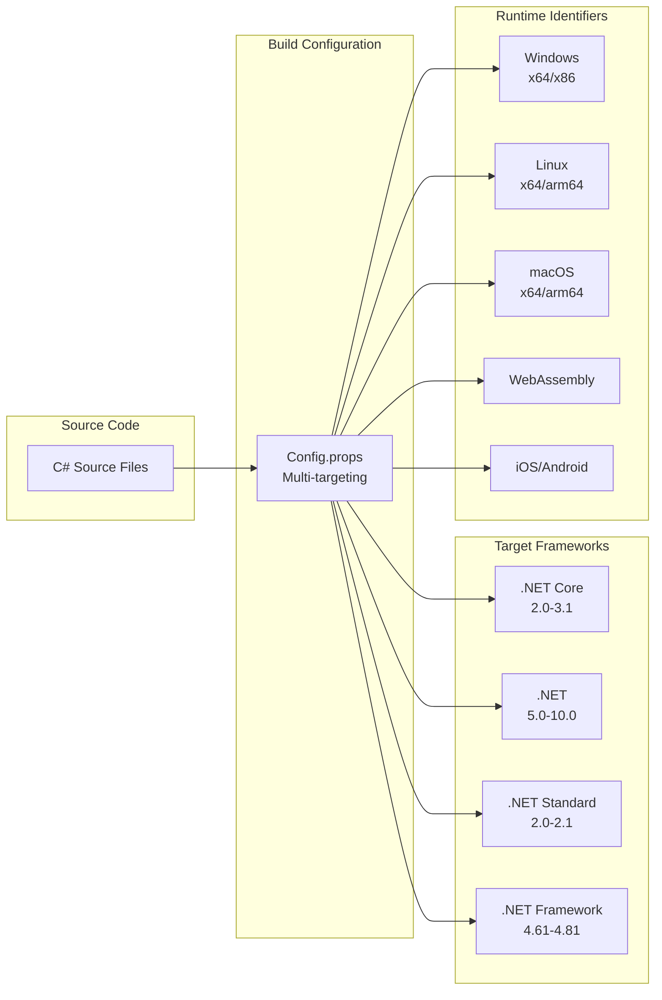
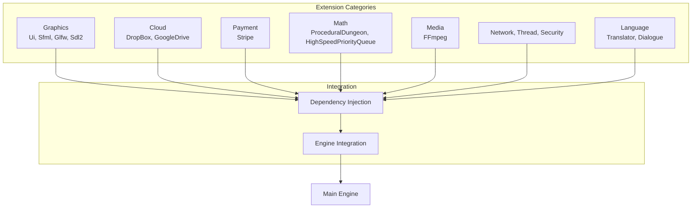

Mermaid diagrams illustrating the Alis solution architecture and relationships.

## Layer Dependency Diagram

## Solution File Dependencies

## ECS Architecture Flow

## Multi-Platform Build Flow

## Extension System Architecture

## See Also
- [[Layered Architecture]]
- [[Entity Component System]]
- [[Extension System]]
