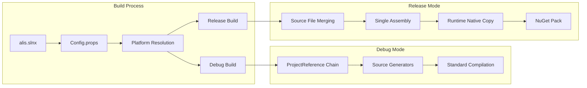
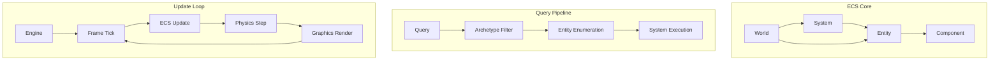
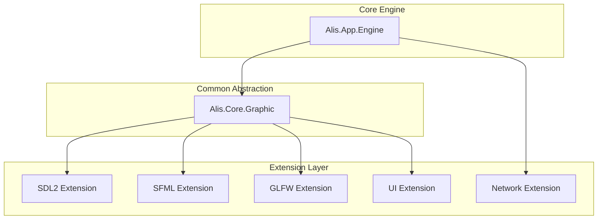
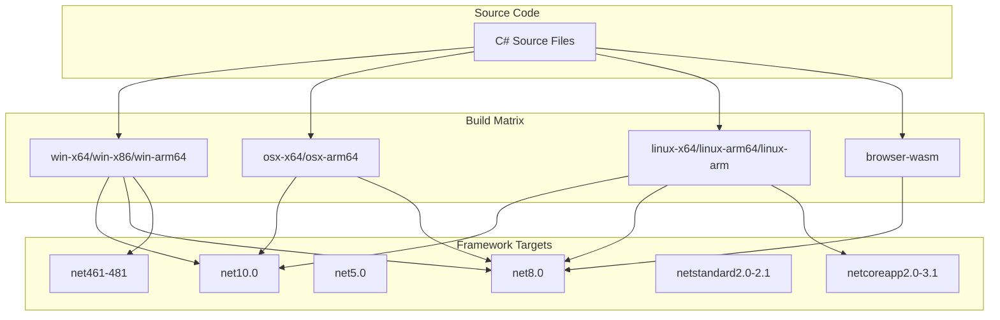

# Architecture Flow Diagrams

## Build Process Flow

## ECS Architecture Flow

## Extension Architecture

## Multi-Platform Targets

## Related

- [[Architecture Overview]]
- [[Dependency Graph]]
- [[Repository Overview]]
