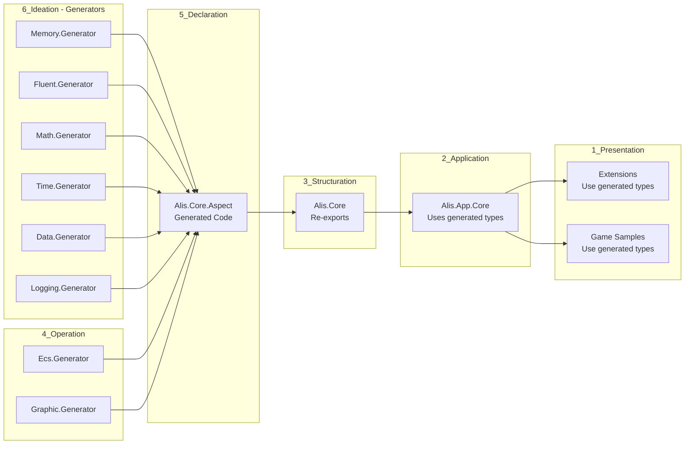
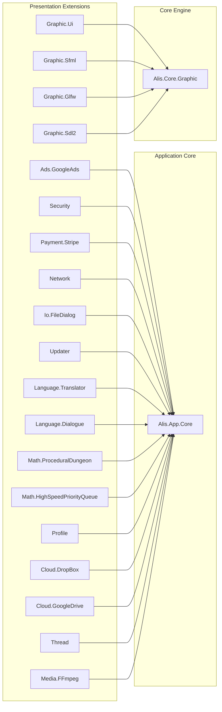

# Architecture Overview Diagram — ALIS

## Layer Architecture (Mermaid)

```mermaid
graph TB
    subgraph "1_Presentation"
        subgraph "Applications"
            APP_ENGINE[Alis.App.Engine]
            APP_HUB[Alis.App.Hub]
            APP_INSTALLER[Alis.App.Installer]
        end
        subgraph "Extensions"
            EXT_ADS[Alis.Extension.Ads.GoogleAds]
            EXT_SEC[Alis.Extension.Security]
            EXT_PAY[Alis.Extension.Payment.Stripe]
            EXT_NET[Alis.Extension.Network]
            EXT_IO[Alis.Extension.Io.FileDialog]
            EXT_UPD[Alis.Extension.Updater]
            EXT_LANG[Alis.Extension.Language.*]
            EXT_MATH[Alis.Extension.Math.*]
            EXT_GRAPHIC[Alis.Extension.Graphic.*]
            EXT_PROF[Alis.Extension.Profile]
            EXT_CLOUD[Alis.Extension.Cloud.*]
            EXT_THREAD[Alis.Extension.Thread]
            EXT_MEDIA[Alis.Extension.Media.FFmpeg]
        end
        BENCH[Alis.Benchmark]
    end

    subgraph "2_Application"
        APP_CORE[Alis.App.Core]
        subgraph "Game Samples"
            SAMPLE_FLAPPY[Flappy Bird]
            SAMPLE_PONG[Pong]
            SAMPLE_DINO[Dino]
            SAMPLE_SPACE[Space Simulator]
            SAMPLE_KING[King Platform]
            SAMPLE_EMPTY[Empty]
            SAMPLE_SPLIT[Split Camera]
            SAMPLE_ASTEROID[Asteroid]
            SAMPLE_ROGUE[Rogue]
            SAMPLE_SNAKE[Snake]
            SAMPLE_RUINS[Ruins of Tartarus]
            SAMPLE_EGG[Egg]
            SAMPLE_INEFABLE[Inefable]
        end
    end

    subgraph "3_Structuration"
        CORE[Alis.Core<br/>Aggregator]
    end

    subgraph "4_Operation"
        ECS[Alis.Core.Ecs<br/>src/test/sample/Generator]
        GRAPHIC[Alis.Core.Graphic<br/>src/test/sample/Generator]
        AUDIO[Alis.Core.Audio<br/>src/test/sample]
        PHYSIC[Alis.Core.Physic<br/>src/test/sample]
    end

    subgraph "5_Declaration"
        ASPECT[Alis.Core.Aspect<br/>Aggregator<br/>(Zero hand-written code)]
    end

    subgraph "6_Ideation"
        subgraph "Aspects"
            IDE_MEM[Memory<br/>src/test/sample/Generator]
            IDE_FLUENT[Fluent<br/>src/test/sample/Generator]
            IDE_MATH[Math<br/>src/test/sample/Generator]
            IDE_TIME[Time<br/>src/test/sample/Generator]
            IDE_DATA[Data<br/>src/test/sample/Generator]
            IDE_LOGGING[Logging<br/>src/test/sample/Generator]
        end
    end

    %% Dependencies
    APP_ENGINE --> APP_CORE
    APP_HUB --> APP_CORE
    APP_INSTALLER --> APP_CORE
    EXT_ADS --> APP_CORE
    EXT_SEC --> APP_CORE
    EXT_PAY --> APP_CORE
    EXT_NET --> APP_CORE
    EXT_IO --> APP_CORE
    EXT_UPD --> APP_CORE
    EXT_LANG --> APP_CORE
    EXT_MATH --> APP_CORE
    EXT_GRAPHIC --> CORE
    EXT_PROF --> APP_CORE
    EXT_CLOUD --> APP_CORE
    EXT_THREAD --> APP_CORE
    EXT_MEDIA --> APP_CORE
    BENCH --> CORE

    SAMPLE_FLAPPY --> CORE
    SAMPLE_PONG --> CORE
    SAMPLE_DINO --> CORE
    SAMPLE_SPACE --> CORE
    SAMPLE_KING --> CORE
    SAMPLE_EMPTY --> CORE
    SAMPLE_SPLIT --> CORE
    SAMPLE_ASTEROID --> CORE
    SAMPLE_ROGUE --> CORE
    SAMPLE_SNAKE --> CORE
    SAMPLE_RUINS --> CORE
    SAMPLE_EGG --> CORE
    SAMPLE_INEFABLE --> CORE

    APP_CORE --> CORE
    CORE --> ECS
    CORE --> GRAPHIC
    CORE --> AUDIO
    CORE --> PHYSIC

    ECS --> ASPECT
    GRAPHIC --> ASPECT
    AUDIO --> ASPECT
    PHYSIC --> ASPECT

    IDE_MEM --> ASPECT
    IDE_FLUENT --> ASPECT
    IDE_MATH --> ASPECT
    IDE_TIME --> ASPECT
    IDE_DATA --> ASPECT
    IDE_LOGGING --> ASPECT

    %% Generator flow (dashed)
    ECS -.->|Generator| ASPECT
    GRAPHIC -.->|Generator| ASPECT
    IDE_MEM -.->|Generator| ASPECT
    IDE_FLUENT -.->|Generator| ASPECT
    IDE_DATA -.->|Generator| ASPECT
```

## Generator Cascade (Mermaid)



## Extension Dependency Map (Mermaid)



## Related

- [[diagrams/dependency-graph]] — Dependency visualization
- [[architecture/dependency-graph]] — Dependency rules
- [[architecture/repository-overview]] — Full architecture
- [[Alis Architecture Overview]] — Architecture concepts
- [[Layered Architecture]] — Layer structure
- [[adr-001-layered-architecture]] — Architecture decisions
- [[build-system]] — Build flow
- [[project-index]] — All projects in diagrams
