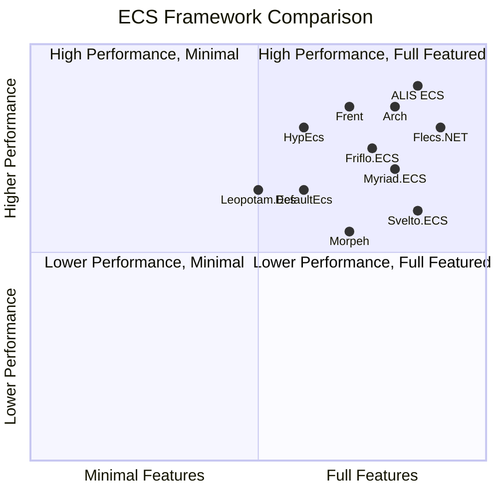
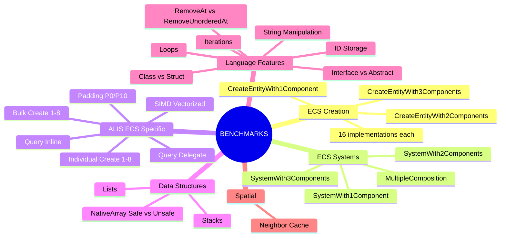
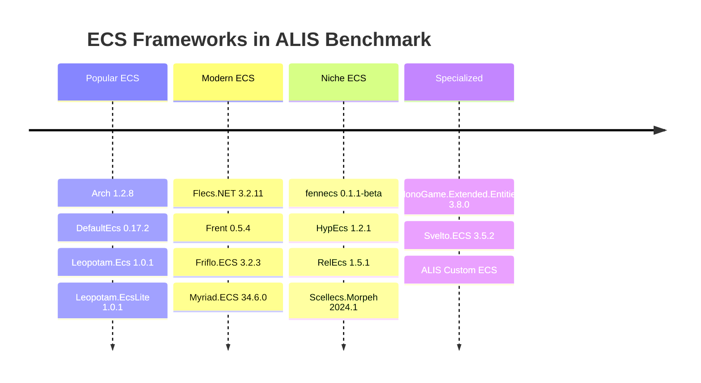

## ECS Frameworks Compared

## Benchmark Categories

## ECS Frameworks Tested (17)

## Related
- [[projects/1_Presentation/Alis.Benchmark]] — Full benchmark documentation
- [[diagrams/ecs-architecture]] — ALIS ECS architecture
- [[diagrams/architecture-overview]] — Layer context
