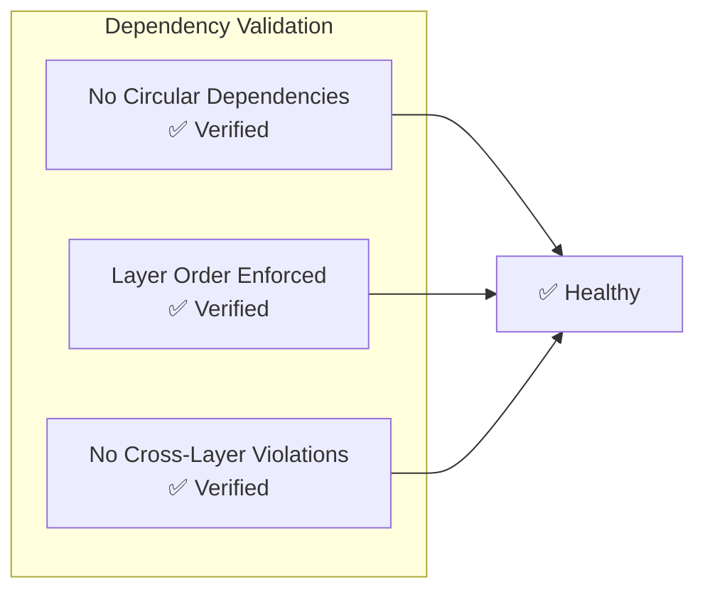

# Dependency Diagrams

tags:
  - diagram,visualization,mermaid

Mermaid diagrams illustrating project dependencies and relationships.

## Layer Dependency Graph

```mermaid
graph TD
    subgraph "Layer 1: Presentation"
        P1[Engine]
        P2[Hub]
        P3[Installer]
        P4[Extension/Ads]
        P5[Extension/Cloud]
        P6[Extension/Graphic]
        P7[Extension/Payment]
        P8[Extension/Media]
    end
    
    subgraph "Layer 2: Application"
        A1[Alis Main]
        A2[Sample Games]
    end
    
    subgraph "Layer 3: Structuration"
        S1[Core Library]
    end
    
    subgraph "Layer 4: Operation"
        O1[ECS + Generator]
        O2[Graphics + Generator]
        O3[Audio]
        O4[Physics]
    end
    
    subgraph "Layer 5: Declaration"
        D1[Core.Aspect]
    end
    
    subgraph "Layer 6: Ideation"
        I1[Memory + Generator]
        I2[Fluent + Generator]
        I3[Data + Generator]
        I4[Math]
        I5[Time]
        I6[Logging]
    end
    
    P1 --> S1
    P1 --> O1
    P1 --> O2
    P1 --> D1
    P1 --> I1
    
    P4 --> S1
    P5 --> S1
    P6 --> S1
    P7 --> S1
    P8 --> S1
    
    A1 --> S1
    A1 --> O1
    A1 --> O2
    
    O1 --> S1
    O1 --> D1
    
    I1 --> S1
    I1 --> D1
    I2 --> S1
    I2 --> D1
    
    style S1 fill:#c8e6c9
    style D1 fill:#fff9c4
```

## Project Reference Matrix

| Project | References | Referenced By |
|---------|------------|---------------|
| **Core** | None | All layers |
| **Engine** | Core, ECS, Graphics, Aspect, Memory | Applications |
| **ECS** | Core, Aspect | Engine, Extensions |
| **Graphics** | Core, ECS | Engine, Extensions |
| **Memory** | Core, Aspect | Ideation, Extensions |
| **Fluent** | Core, Aspect | Ideation |
| **Data** | Core, Aspect | Ideation |

## Circular Dependency Check

## Extension Dependencies

| Extension | Core Deps | Platform APIs |
|-----------|-----------|---------------|
| **Graphic.Ui** | Core, ECS | SDL2, OpenGL |
| **Graphic.Sfml** | Core | SFML Library |
| **Graphic.Glfw** | Core | GLFW Library |
| **Graphic.Sdl2** | Core | SDL2 Library |
| **Cloud.DropBox** | Core | Dropbox API |
| **Cloud.GoogleDrive** | Core | Google Drive API |
| **Payment.Stripe** | Core | Stripe API |
| **Media.FFmpeg** | Core | FFmpeg Library |

## See Also
- [[Dependency Management]]
- [[Layered Architecture]]
