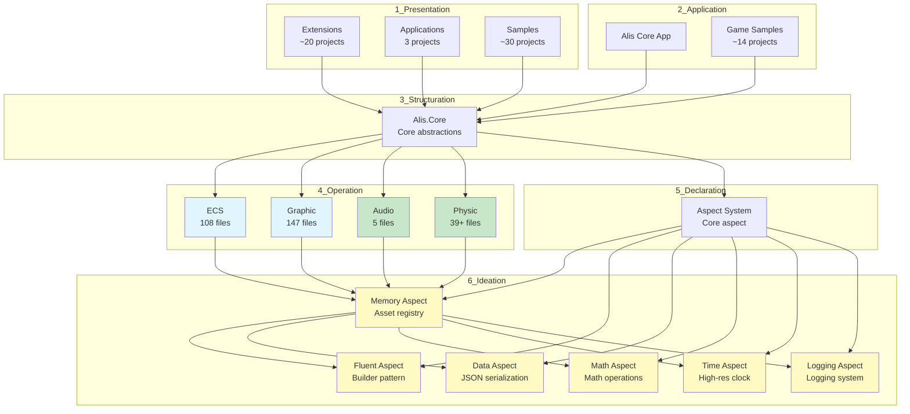

## Architecture Overview

## Layer Dependencies

### 1_Presentation → 3_Structuration
- All extensions depend on **Alis.Core** for base abstractions

### 4_Operation → 3_Structuration + 6_Ideation
- **ECS, Graphic** depend on **Alis.Core** and **Memory aspect**
- **Audio, Physic** depend on **Alis.Core** and **Memory aspect**

### 6_Ideation → 3_Structuration + External
- All aspects depend on **Alis.Core**
- **Memory aspect** adds external dependencies: System.Buffers, System.IO.Compression

## Documentation Status

| Layer | Total | Documented | Coverage |
|---|---|---|---|
| 4_Operation | 14 | 4 | 29% |
| 6_Ideation | 18 | 6 | 33% |

## Next Steps

1. Document remaining 4_Operation projects (Input, Resource, Scene, Serialization, Window + tests/generators)
2. Document 6_Ideation generators and samples
3. Process Extensions (1_Presentation/Extension)

## Related

- [[diagrams/architecture-overview]] — Full architecture diagrams
- [[architecture/dependency-graph]] — Dependency rules
- [[dependencies/dependency-graph]] — Raw dependency data
- [[architecture/repository-overview]] — Architecture overview
- [[dependency-index]] — Dependency index
- [[layer-index]] — Layer breakdown
- [[project-index]] — All projects
- [[adr-001-layered-architecture]] — Dependency rules decision

