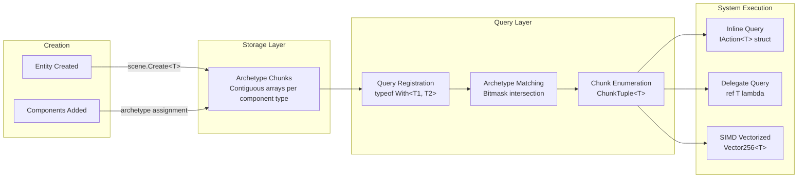
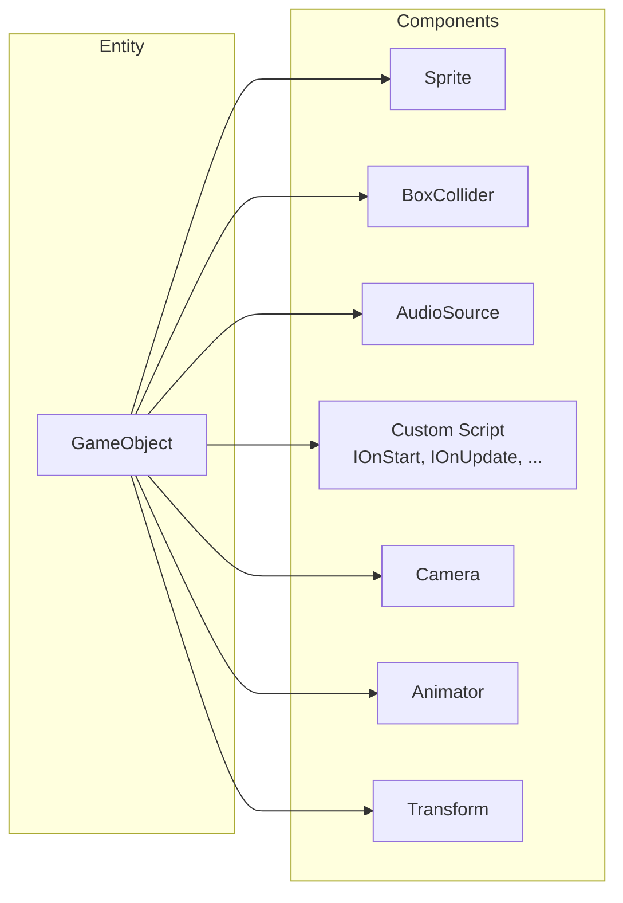
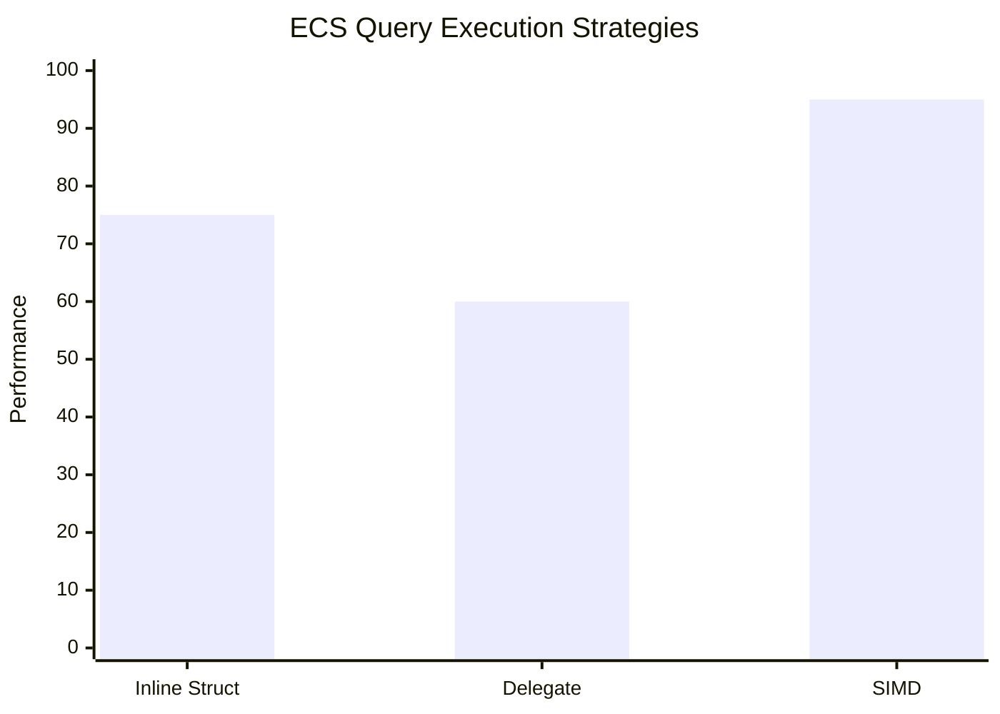

## Core Data Flow



## Chunk-Based Storage

```mermaid
block-beta
    columns 1
    block "Scene" 
        block "Archetype A (1 component)"
            c1_1["Chunk 1<br/>Component1[]"]
            c1_2["Chunk 2<br/>Component1[]"]
        end
        block "Archetype B (2 components)"
            c2_1["Chunk 1<br/>Component1[] + Component2[]"]
        end
    end
    
    style c1_1 fill:#e1f5fe
    style c1_2 fill:#e1f5fe
    style c2_1 fill:#c8e6c9
```

## Entity Component Composition



## System Execution Comparison



## Available Queries

```mermaid
flowchart TD
    subgraph "Query Types"
        Q_INLINE[Query.Inline&lt;TAction, T&gt;]
        Q_DELEGATE[Query.Delegate(ref T)]
        Q_SIMD[Manual SIMD<br/>MemoryMarshal.Cast + Vector256]
        Q_CHUNK[Query.EnumerateChunks&lt;T&gt;]
    end
    
    Q_CHUNK --> Q_SIMD
    Q_CHUNK --> Q_INLINE
    
    subgraph "Create Patterns"
        C_SINGLE[scene.Create&lt;T&gt;]
        C_MULTI[scene.CreateMany&lt;T&gt;]
        C_BULK[scene.Create&lt;T1, T2, ...&gt;]
    end
    
    C_SINGLE --> STORAGE[(Chunk Storage)]
    C_MULTI --> STORAGE
    C_BULK --> STORAGE
```

## Related
- [[projects/4_Operation/Alis.Core.Ecs]] — Full ECS documentation
- [[diagrams/architecture-overview]] — Layer context
- [[diagrams/dependency-graph]] — Module dependencies
- [[diagrams/game-pipeline]] — Game bootstrap flow
