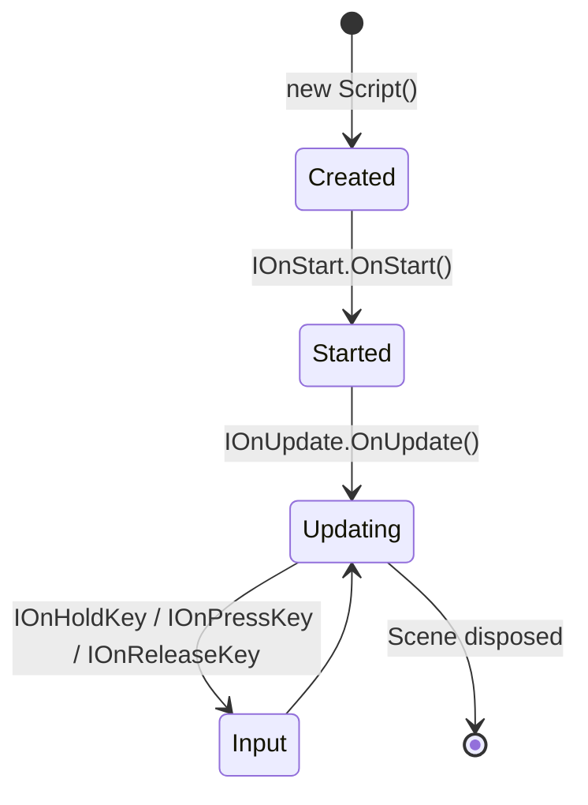

## VideoGame Bootstrap Flow

```mermaid
flowchart TD
    START[VideoGame.Create] --> SETTINGS[.Settings]
    SETTINGS --> GENERAL[.General<br/>Name, Author, Description, License, Icon]
    SETTINGS --> AUDIO[.Audio<br/>Volume]
    SETTINGS --> GRAPHIC[.Graphic<br/>Resolution, FrameRate, BackgroundColor, Target]
    SETTINGS --> PHYSIC[.Physic<br/>Gravity, Debug]
    
    GENERAL --> WORLD[.World]
    AUDIO --> WORLD
    GRAPHIC --> WORLD
    PHYSIC --> WORLD
    
    WORLD --> SCENE_ADD[.Add&lt;Scene&gt;]
    SCENE_ADD --> GAMEOBJECT[.Add&lt;GameObject&gt;]
    GAMEOBJECT --> TRANSFORM[.Transform<br/>Position, Scale, Rotation]
    GAMEOBJECT --> WITH_COMP[.WithComponent&lt;T&gt;]
    GAMEOBJECT --> WITH_SCRIPT[.WithComponent(new Script())]
    
    WITH_COMP --> SCENE_DONE[Scene complete]
    WITH_SCRIPT --> SCENE_DONE
    
    SCENE_DONE --> MULTI_SCENE{More scenes?}
    MULTI_SCENE -->|Yes| SCENE_ADD
    MULTI_SCENE -->|No| RUN[.Run]
    
    RUN --> GAME_LOOP{Game Loop}
    
    subgraph "Game Loop"
        GAME_LOOP --> INPUT[Input Processing]
        INPUT --> UPDATE[Update Systems<br/>IOnStart → IOnUpdate]
        UPDATE --> PHYSICS[Physics Step]
        PHYSICS --> RENDER[Render Frame]
        RENDER --> CHECK_EXIT{Exit?}
        CHECK_EXIT -->|No| INPUT
    end
    
    CHECK_EXIT -->|Yes| EXIT[Exit]
```

## Program Entry Point Patterns

```mermaid
flowchart LR
    subgraph "Minimal (Snake)"
        MIN[VideoGame.Create<br/>.Run]
    end
    
    subgraph "Configured (Dino/Egg)"
        CONF[VideoGame.Create<br/>.Settings(...)<br/>.World(...)<br/>.Run]
    end
    
    subgraph "Complex (Asteroid/Flappy)"
        COMPLEX[VideoGame.Create<br/>.Settings(...)<br/>.World<br/>  .Add&lt;Scene&gt;<br/>    .Add&lt;GameObject&gt;<br/>      .WithComponent&lt;T&gt;<br/>      .WithComponent(new Script)<br/>.Run]
    end
    
    subgraph "Persisted (King Platform)"
        SAVE[VideoGame.Create<br/>...<br/>.Build<br/>.Save<br/>.Run]
    end
    
    MIN --> CONF --> COMPLEX --> SAVE
```

## Script Lifecycle



## Related
- [[diagrams/architecture-overview]] — Full architecture
- [[diagrams/ecs-architecture]] — ECS component flow
- [[projects/2_Application/Samples]] — Sample implementations
