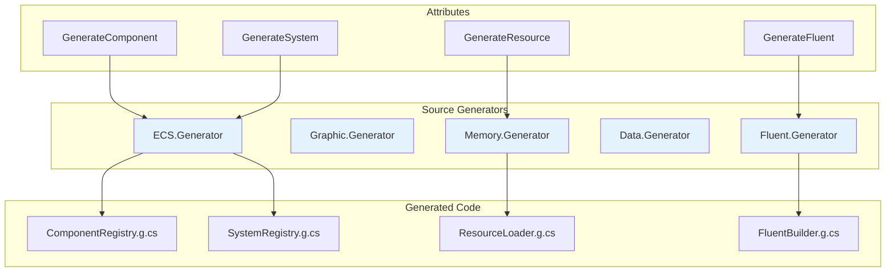
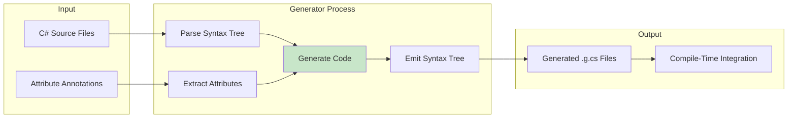
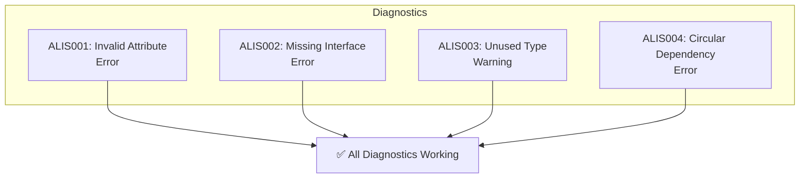
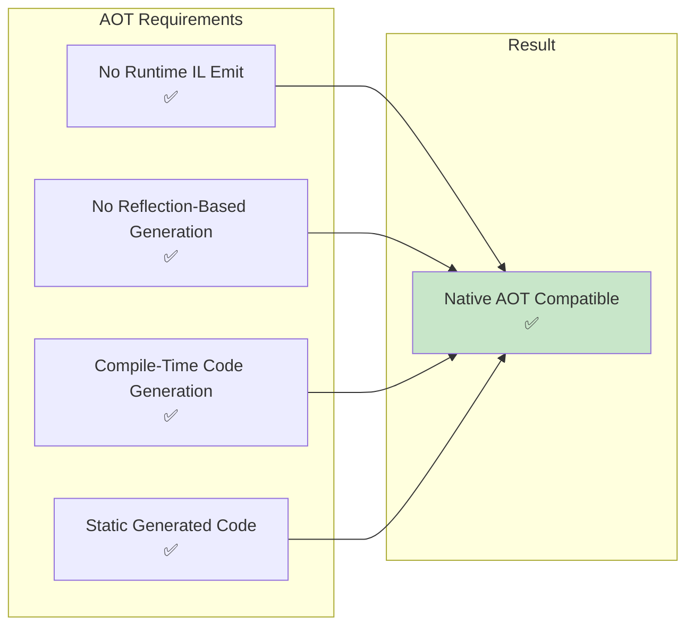

Mermaid diagrams illustrating source generator architecture and code generation flow.

## Generator Architecture Overview

## Code Generation Flow

## Generator Diagnostics

| ID | Severity | Description |
|----|----------|-------------|
| ALIS001 | Error | Invalid component attribute |
| ALIS002 | Error | Missing required interface |
| ALIS003 | Warning | Unused generated type |
| ALIS004 | Error | Circular dependency detected |
| ALIS005 | Error | Invalid resource marker |

## AOT Compatibility

## See Also
- [[Generator Pattern]]
- [[Multi-Targeting Strategy]]
