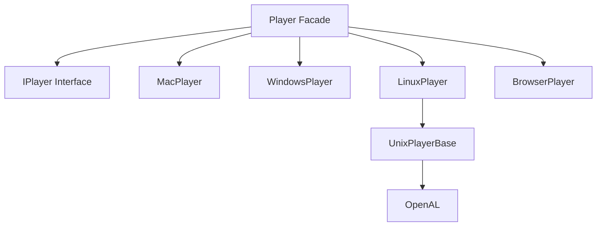

# Audio Domain

## Overview

Cross-platform audio playback system with OS-specific backends.

## Module

**Assembly:** `Alis.Core.Audio`
**Layer:** 4_Operation
**Path:** `4_Operation/Audio/src/`
**Files:** 8 source files

## Architecture

## Key Types

| Type | Description |
|---|---|
| `Player` | Static facade, OS-conditional dispatch via `#if` |
| `IPlayer` | Interface: Play, PlayLoop, Pause, Resume, Stop, SetVolume |
| `MacPlayer` | macOS audio backend |
| `WindowsPlayer` | Windows audio backend |
| `LinuxPlayer` | Linux audio backend (via OpenAL) |
| `BrowserPlayer` | WebAssembly audio backend |
| `UnixPlayerBase` | Shared Unix base class |
| `OpenAL` | OpenAL P/Invoke bindings |

## Platform Detection

Uses conditional compilation:
- `OSX` → MacPlayer
- `WIN` → WindowsPlayer
- `LINUX` → LinuxPlayer
- `browser-wasm` → BrowserPlayer

## Dependencies

- Depends on: Layer 5 (Declaration) via Config.props
- External: None (OpenAL is a native system library)

## Related

- [[Alis.Core.Audio]]
- [[Alis.Core.Graphic]]
- [[ecs-domain]]
