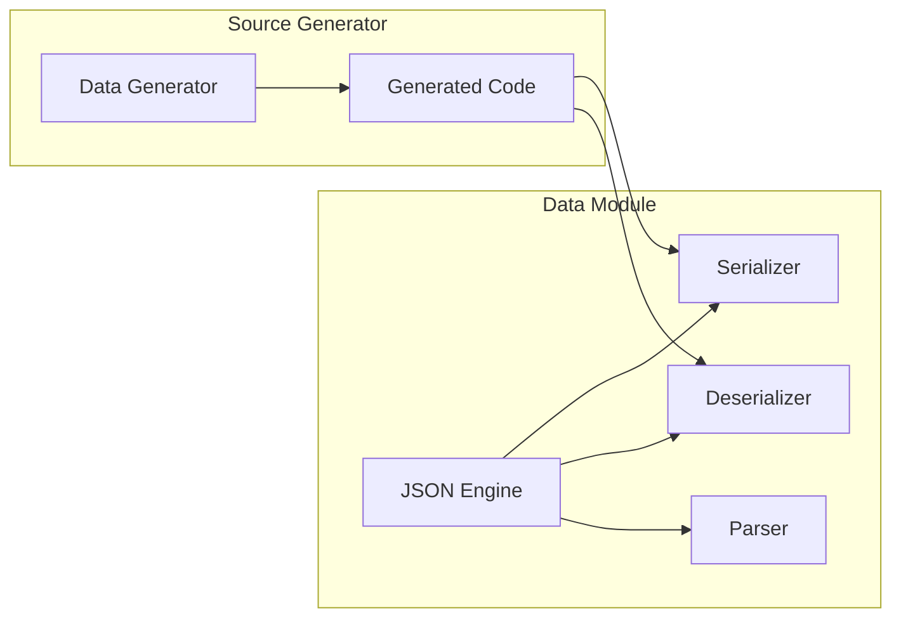

# Data Domain

## Overview

The Data domain provides serialization and deserialization capabilities, primarily focused on JSON processing. Implemented in [[Alis.Core.Aspect.Data]].

## Architecture

## Key Features

- JSON serialization/deserialization
- Source-generated serialization code for AOT compatibility
- No runtime reflection for serialization
- Customizable parsing options

## Module Structure

- `src/Json/` - JSON processing engine
- `generator/` - Roslyn source generator for serialization code

## Related

- [[Alis.Core.Aspect.Data]]
- [[Alis.Core.Aspect.Data.Generator]]
- [[Serialization Pattern]]
- [[Projects Index]]
