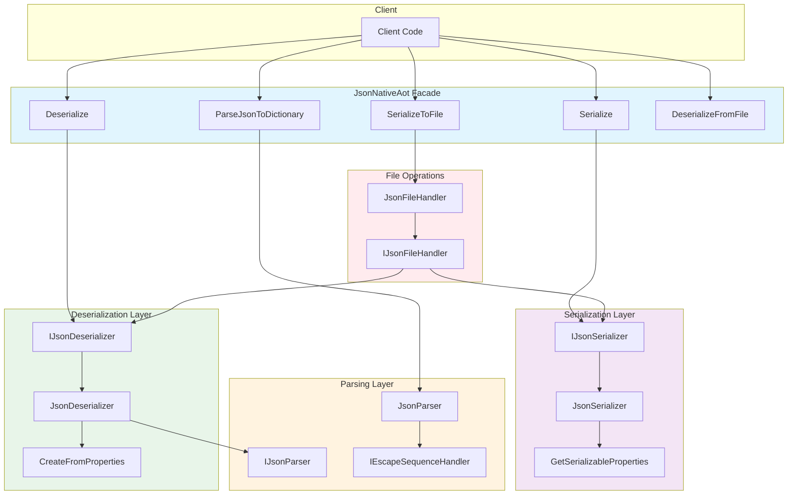
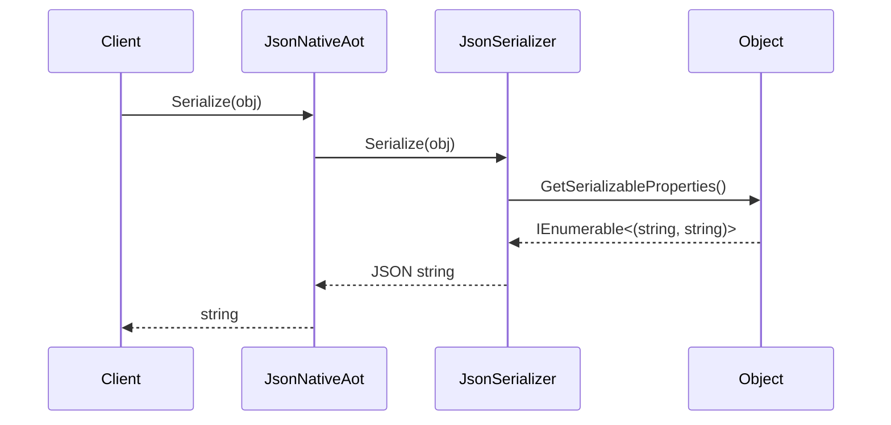
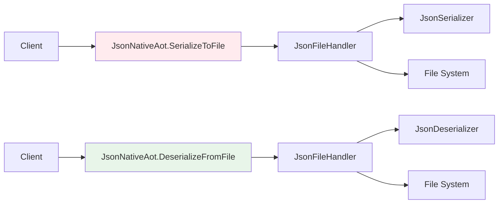
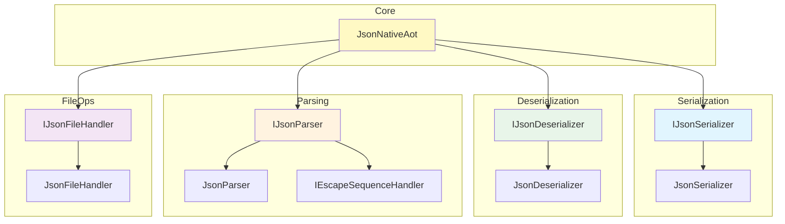

## Main Pipeline



## Serialization Flow



## Deserialization Flow

```mermaid
sequenceDiagram
    participant Client
    participant JsonNativeAot
    participant JsonDeserializer
    participant JsonParser
    participant Object
    
    Client->>JsonNativeAot: Deserialize<T>(json)
    JsonNativeAot->>JsonDeserializer: Deserialize<T>(json)
    JsonDeserializer->>JsonParser: ParseToDictionary(json)
    JsonParser-->>JsonDeserializer: Dictionary<string, string>
    JsonDeserializer->>new T(): CreateFromProperties(dict)
    Object-->>JsonDeserializer: T instance
    JsonDeserializer-->>JsonNativeAot: T
    JsonNativeAot-->>Client: T
```

## File Operations Flow



## Component Relationships



## Related

- [[Architecture]] - Architecture patterns
- [[Dependencies]] - Dependency graph
