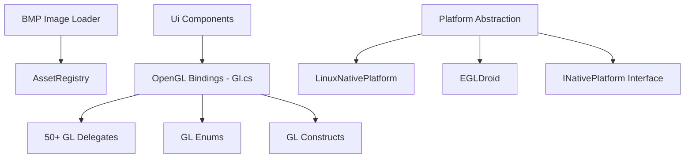

# Graphics Domain

## Overview

Low-level graphics abstraction with OpenGL bindings, BMP image loading, and platform-specific window management.

## Module

**Assembly:** `Alis.Core.Graphic`
**Layer:** 4_Operation
**Path:** `4_Operation/Graphic/src/`
**Files:** 147 source files

## Architecture

## Key Types

| Type | Description |
|---|---|
| `Gl` | Static OpenGL bindings (788 lines), all GL functions as static delegates |
| `Image` | BMP loader (RGB, RLE4, RLE8, 1/4/8/24/32 bpp) |
| `INativePlatform` | Platform abstraction (window, input, OpenGL context) |
| `LinuxNativePlatform` | Linux X11 backend |
| `EGLDroid` | Android EGL backend |
| `GLShader` | Shader wrapper |
| `GLShaderProgram` | Shader program wrapper |
| `GLShaderProgramParam` | Shader parameter |

## OpenGL Coverage

The `Gl` class provides bindings for:
- Shader operations (create, compile, link, uniforms)
- Texture management (gen, bind, load, parameters)
- Buffer operations (VBO, VAO)
- Framebuffer objects
- Blending, scissoring
- Draw calls (DrawArrays, DrawElements)
- State management

## Platform Backends

| Platform | Implementation | Native API |
|---|---|---|
| Linux | LinuxNativePlatform | X11 |
| macOS | MacNativePlatform | Cocoa/NSOpenGL |
| Windows | WindowsNativePlatform | Win32/WGL |
| Android | EGLDroid | EGL |
| Browser | BrowserNativePlatform | WebGL/Emscripten |

## Image Support

BMP format support:
- Uncompressed RGB (1, 4, 8, 24, 32 bpp)
- RLE4 compression
- RLE8 compression
- Bitfield compression
- Palette support

## Dependencies

- Depends on: Layer 5 (Declaration)
- Uses: `AssetRegistry` from Layer 6 for resource loading

## Related

- [[Alis.Core.Graphic]]
- [[ecs-domain]]
- [[physic-domain]]
