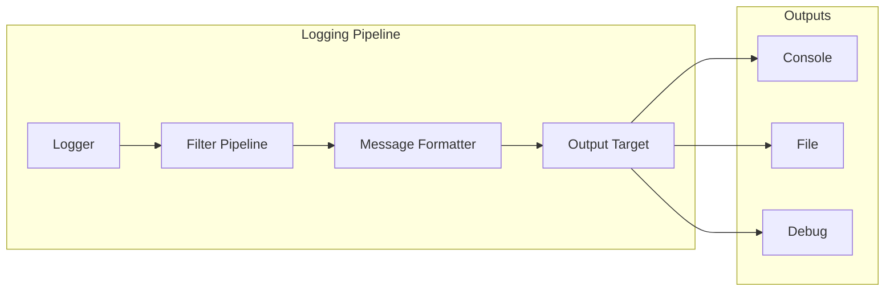

# Logging Domain

## Overview

The Logging domain provides configurable logging infrastructure with filter pipelines, message formatting, and multiple output targets. Implemented in [[Alis.Core.Aspect.Logging]].

## Architecture

## Module Structure

| Directory | Purpose |
|---|---|
| `Abstractions/` | Logging interfaces and contracts |
| `Core/` | Core logging engine (Logger, LoggerFactory) |
| `Filters/` | Log level and content filtering |
| `Formatters/` | Message formatting strategies |
| `Outputs/` | Log output destinations |

## Related

- [[Alis.Core.Aspect.Logging]]
- [[Alis.Core.Aspect.Logging.Generator]]
- [[Projects Index]]
