# Physics Domain

## Overview

Comprehensive 2D physics engine with collision detection, rigid body dynamics, joints, and polygon operations.

## Module

**Assembly:** `Alis.Core.Physic`
**Layer:** 4_Operation
**Path:** `4_Operation/Physic/src/`
**Files:** 194 source files (largest module)

## Architecture

```mermaid
graph TD
    Collisions[Collisions] --> Broadphase[DynamicTreeBroadPhase]
    Collisions --> NarrowPhase[TOI, Simplex, Manifold]
    Dynamics[Dynamics] --> Bodies[Bodies]
    Dynamics --> Joints[Joints]
    Dynamics --> Contacts[Contacts]
    Dynamics --> Solver[Solver]
    Dynamics --> Islands[Islands]
    Controllers[Controllers] --> Buoyancy[BuoyancyController]
    Controllers --> Gravity[GravityController]
    Controllers --> VelocityLimit[VelocityLimitController]
    Common[Common Math] --> Mat22[Mat22, Mat33]
    Common --> Vertices[Vertices]
    Common --> Decomposition[Polygon Decomposition]
    Common --> ConvexHull[Convex Hull]
    Common --> TextureTools[MarchingSquares, Terrain]
```

## Key Subsystems

### Collisions
| Type | Description |
|---|---|
| `DynamicTree` | AABB tree for broadphase |
| `DynamicTreeBroadPhase` | Broadphase collision detection |
| `TimeOfImpact` | TOI calculation |
| `Simplex` | GJK simplex |
| `ManifoldPoint` | Contact manifold |

### Dynamics
| Type | Description |
|---|---|
| `Body` | Rigid body (static, kinematic, dynamic) |
| `Joint` types | Revolute, Prismatic, Weld, Rope, Motor, Pulley, Gear, Angle, Distance, Friction |
| `Contact` | Contact management |
| `Island` | Island sleeping/wake |
| `Solver` | Sequential impulse solver |

### Controllers
| Type | Description |
|---|---|
| `BuoyancyController` | Fluid buoyancy simulation |
| `GravityController` | Point/mixed gravity |
| `VelocityLimitController` | Speed limiting |

### Common Math
| Type | Description |
|---|---|
| `Mat22`, `Mat33` | 2x2 and 3x3 matrices |
| `Vertices` | Polygon vertex list |
| `PolygonTools` | Polygon utilities |
| `Path` | Path management |
| `LineTools` | Line intersection/geometry |

### Polygon Decomposition
| Algorithm | Description |
|---|---|
| Bayazit | Convex decomposition |
| CDT/Delaunay | Constrained Delaunay triangulation |
| Earclip | Ear clipping triangulation |
| Flipcode | Flipcode decomposition |
| Seidel | Seidel's algorithm |

### Convex Hull
| Algorithm | Description |
|---|---|
| GiftWrap | Jarvis march |
| Melkman | Simple polygon hull |
| ChainHull | Chain-based hull |

### Texture Tools
| Tool | Description |
|---|---|
| MarchingSquares | Polygon generation from images |
| Terrain | Terrain generation |

## Physics Settings

`SettingEnv` controls:
- CCD sub-steps
- GJK iterations
- Sleeping thresholds
- Velocity/position iterations
- Baumgarte stabilization
- Polygon radius

## Dependencies

- Depends on: Layer 5 (Alis.Core.Aspect)

## Related

- [[Alis.Core.Physic]]
- [[ecs-domain]]
- [[graphic-domain]]
