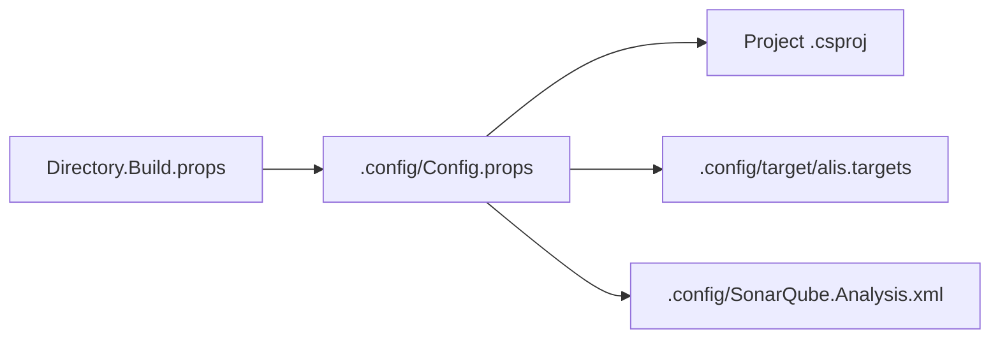

# Build Infrastructure

## Overview

The Alis build infrastructure manages **140+ projects** across **8 solution files** with **15+ target frameworks** and **13 runtime identifiers**.

## Solution Files

| Solution | Projects | Purpose |
|---|---|---|
| `alis.slnx` | All | Complete monorepo build |
| `alis_design.sln` | Core | IDE-optimized design-time |
| `alis.core.slnx` | Core | Core layer only |
| `alis.extensions.slnx` | Extensions | Extension layer only |
| `alis.apps.slnx` | Apps | Application projects |
| `alis.test.slnx` | Tests | Test projects |
| `alis.benchmark.slnx` | Benchmarks | Benchmark projects |
| `alis.samples.slnx` | Samples | Sample projects |

## Configuration Chain



## Key Infrastructure Components

### 1. Multi-Target Build Matrix

The `.config/Config.props` defines build configurations for:
- **6 debug targets**: netcoreapp2.0, net5.0, net8.0, net10.0, netstandard2.0, net461
- **19+ release targets**: All major .NET versions + platform-specific
- **13 RIDs**: win-x64, win-x86, win-arm64, osx-x64, osx-arm64, linux-x64, linux-arm64, linux-arm, browser-wasm, android-arm64, android-x64, ios-arm64, iossimulator-arm64/x64

### 2. Layer Dependency Resolution

Dependencies are resolved by directory prefix matching:
```xml
<ProjectReference Condition="$(ProjectDir.Contains('1_Presentation'))"
    Include="$(SolutionDir)2_Application/**/src/**/Alis.csproj"/>
```

### 3. Source Generator Injection

All 12 generator projects are injected as Roslyn analyzers:
- Referenced as `OutputItemType="Analyzer"` with `PrivateAssets="all"`
- Target `netstandard2.0` only
- Chain: Presentation references all generators, Application references all except Presentation, etc.

### 4. Release Mode Source Merging

Source files from lower layers compiled directly into higher-layer assemblies:
```xml
<Compile Condition="$(ProjectDir.Contains('2_Application'))"
    Include="$(SolutionDir)3_Structuration/Core/**/src/**/*.cs;"/>
```

### 5. Asset Packing Pipeline


### 6. NuGet Packaging

- All projects are packable (except samples/tests)
- NuGet package includes:
  - Multi-platform runtimes
  - Source generator analyzers
  - Native binaries per platform
  - License and docs

### 7. Platform Bundle Targets

The build creates platform-specific bundles:
- **macOS**: `.dmg` with `.app` bundle
- **Linux**: `.zip` archive
- **Windows**: `.zip` archive

## Related

- [[Build System]]
- [[Config.props Reference]]
- [[Architecture Overview]]
- [[Repository Overview]]
