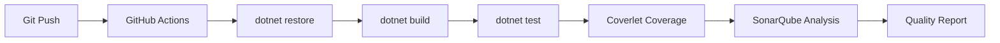

# CI/CD Infrastructure

## Overview

Alis uses GitHub Actions for continuous integration and deployment, with SonarQube for static analysis.

## Configuration Files

| File | Purpose |
|---|---|
| `.github/workflows/*.yml` | GitHub Actions workflows |
| `.config/SonarQube.Analysis.xml` | SonarQube analysis settings |
| `.config/coverlet.runsettings` | Code coverage thresholds |
| `.config/xunit.runner.json` | Test runner configuration |

## CI Pipeline

## Quality Gates

- SonarQube with custom ruleset
- Code coverage via coverlet
- Warning-as-errors enabled
- SonarQube warnings suppressed (noise reduction)

## Test Infrastructure

- xUnit framework with Moq mocking
- Xunit.StaFact for STA thread tests
- Results in TRX format at `.test/<TargetFramework>/`
- Coverage thresholds in `.config/coverlet.runsettings`

## Related

- [[Build Infrastructure]]
- [[Build System]]
- [[Testing Overview]]
