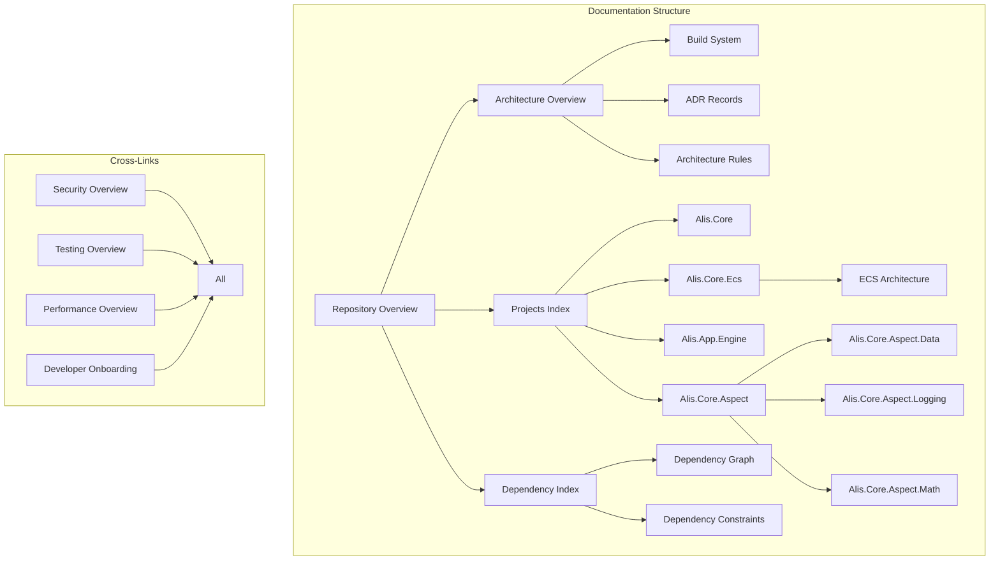

# Knowledge Graph Index

## Core Relationships

## Architectural Clusters

### Core Engine Cluster
- [[Alis.App.Engine]] - Main engine application
- [[Alis.Core.Ecs]] - ECS architecture
- [[Alis.Core.Graphic]] - Graphics rendering
- [[Alis.Core.Physic]] - Physics simulation
- [[Alis.Core.Audio]] - Audio system
- [[Alis.Core.Aspect]] - Aspect framework

### Extension Cluster
- [[Alis.Extension.Graphic.Sdl2]]
- [[Alis.Extension.Graphic.Sfml]]
- [[Alis.Extension.Graphic.Glfw]]
- [[Alis.Extension.Graphic.Ui]]
- [[Alis.Extension.Network]]
- [[Alis.Extension.Security]]

### Build & Configuration Cluster
- [[Build System]]
- [[Config.props Reference]]
- [[Generators]]
- [[Technology Stack]]

### Sample Games Cluster
- [[Alis.Sample.Asteroid]]
- [[Alis.Sample.FlappyBird]]
- [[Alis.Sample.Pong]]
- [[Alis.Sample.KingPlatform]]
- [[Samples Index]]

## Semantic Tags

| Tag | Documents |
|---|---|
| #architecture | Architecture, Build, Config |
| #ecs | ECS, Samples |
| #security | Security Overview |
| #performance | Performance Overview |
| #testing | Testing Overview |
| #samples | All sample docs |
| #generator | All generator docs |
| #layer-1 | All presentation projects |
| #layer-6 | All ideation projects |

## Related

- [[Glossary Index]]
- [[Concepts Index]]
- [[System Metadata Index]]
