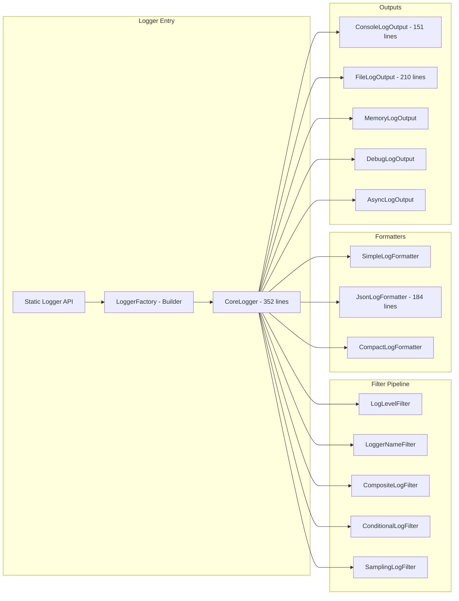

# Alis.Core.Aspect.Logging - Detailed Source Analysis

## Overview

The Logging project contains **24 source files** implementing a pipeline-based logging system with pluggable outputs, formatters, and filters.

## Architecture

## Interfaces

| Interface | Purpose |
|---|---|
| `ILogger` | Logging contract (Trace, Debug, Info, Warn, Error, Fatal) |
| `ILogOutput` | Output destination contract |
| `ILogFormatter` | Log entry formatting |
| `ILogEntry` | Log entry data structure |
| `ILogFilter` | Filter decision contract |

## Filter Pipeline (6 filters)

| Filter | Description |
|---|---|
| `LogLevelFilter` | Minimum level threshold |
| `LoggerNameFilter` | Filter by logger name pattern |
| `CompositeLogFilter` | Combine multiple filters |
| `ConditionalLogFilter` | Predicate-based filtering |
| `SamplingLogFilter` | Rate-limited sampling |

## Output Targets (5 outputs)

| Output | Lines | Description |
|---|---|---|
| `ConsoleLogOutput` | 151 | Colored console output |
| `FileLogOutput` | 210 | File appending output |
| `MemoryLogOutput` | - | In-memory ring buffer |
| `DebugLogOutput` | - | System.Diagnostics.Debug |
| `AsyncLogOutput` | - | Async buffered wrapper |

## Formatters (3 formatters)

| Formatter | Lines | Description |
|---|---|---|
| `SimpleLogFormatter` | - | `[TIME] [LEVEL] message` |
| `JsonLogFormatter` | 184 | Structured JSON output |
| `CompactLogFormatter` | - | Minimal format |

## Key Implementation Details

- **CoreLogger** (352 lines): Thread-safe logger implementation
- **LogEntry** (137 lines): Immutable log entry with all metadata
- **LoggerFactory** (213 lines): Fluent builder with `IDisposable`
- **Logger** (183 lines): Legacy static API wrapper
- **LoggerScope** : Scope/NDC support via `IDisposable`

## Related

- [[Alis.Core.Aspect.Logging]]
- [[Logging Domain]]
- [[Aspect-Oriented Design]]
- [[Projects Index]]
