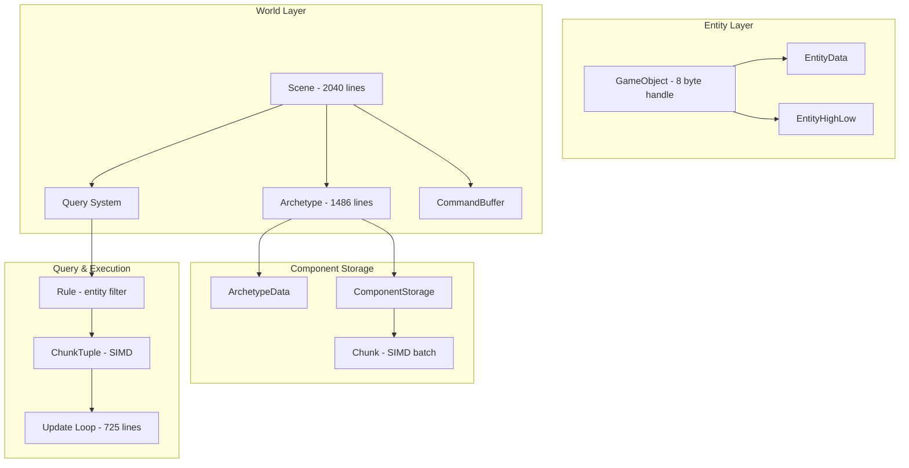

# Alis.Core.Ecs - Detailed Source Analysis

## Overview

The ECS project is the core game object model with **101 source files** implementing an **archetype-based Entity-Component-System** architecture.

## Architecture

## Key Types

### GameObject (2133 lines)
- 8-byte packed struct - the primary entity handle
- `IEquatable<GameObject>`, `IComparable<GameObject>`
- Entity operations: add/remove/get component, hierarchy management

### Scene (2040 lines)
- Central ECS container managing entities, components, and systems
- Entity lifecycle (create, destroy)
- System execution ordering
- Scene graph management

### Archetype (1486 lines)
- Core entity grouping by component composition
- Manages contiguous component arrays
- Archetype graph edges for structural transitions
- `ArchetypeData` record struct for identity

### Query System
- `Rule` - Entity filter specification (include/exclude components)
- `Query` (379 lines) - Rule-based entity set filtering
- `QueryEnumerator` - Entity iteration
- `ChunkTuple<T1..T6>` (417 lines) - SIMD-friendly batch processing

### Collections
- `SparseSet<T>` - O(1) access sparse set
- `FastestStack<T>` (694 lines) - Optimized stack
- `FastestTable<T>` - High-performance table
- `FrugalStack<T>` - Minimal allocation stack
- `Chunk<T>` - SIMD-friendly data chunk
- `FastLookup` - Archetype lookup (pack=8)

### Update System
- `UpdateLoop` (725 lines) - Core update execution
- `ComponentStorage<TComponent>` - Abstract component storage
- `UpdateOrderAttribute` - System ordering
- `CommandBuffer` - Deferred structural changes

### Events
- `Event<T>` - Typed event system
- `GenericEvent` - Unbound generic event collection
- `ComponentEvent` - Component lifecycle events

## Component System

| Type | Description |
|---|---|
| `Component<T>` | Static component metadata |
| `ComponentHandle` | Readonly component reference |
| `ComponentId` | Lightweight component identifier |
| `ComponentRegistry` | Global component registration |
| `ComponentDelegates` | Component delegate types |

## Performance Design

- **8-byte entity handle** minimizes memory footprint
- **Archetype-based storage** for cache-friendly iteration
- **ChunkTuple SIMD** for batch component processing
- **Custom collections** avoid allocation overhead
- **No virtual dispatch** in hot paths
- **Sparse sets** for O(1) component lookup

## Related

- [[Alis.Core.Ecs]]
- [[ECS Domain]]
- [[ECS Architecture Concept]]
- [[Performance Overview]]
- [[Projects Index]]
