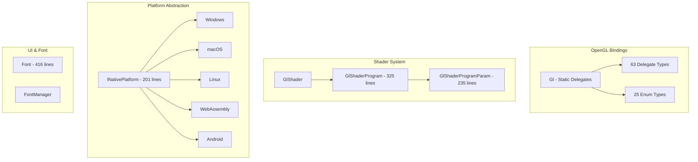

# Alis.Core.Graphic - Detailed Source Analysis

## Overview

The Graphics project contains **~130 source files** implementing OpenGL-based rendering with platform abstraction and font rendering.

## Architecture

## Key Types

### OpenGL Core (788 lines)
- `Gl` static class with all OpenGL function delegate bindings
- 63 delegate types for OpenGL entry points
- 25 enum types for OpenGL constants
- Managed wrappers for shader objects

### Shader System

| Type | Lines | Description |
|---|---|---|
| `GlShader` | - | Shader object wrapper |
| `GlShaderProgram` | 325 | Shader program management |
| `GlShaderProgramParam` | 235 | Uniform parameter handling |

### Platform Support (33 files)

| Platform | Key Class | Technology |
|---|---|---|
| Windows | `WinNativePlatform` | Win32, OpenGL32 |
| macOS | `MacNativePlatform` | Cocoa, NSOpenGL |
| Linux | `LinuxNativePlatform` | X11, GLX |
| Web | `WebAssemblyPlatform` | Emscripten, WebGL |
| Android | `EGLDroid` | EGL, OpenGL ES |

### UI & Font

| Type | Lines | Description |
|---|---|---|
| `Font` | 416 | Font loading and rendering |
| `FontManager` | - | Default font and text rendering |
| `Image` | 623 | Image loading and texture processing |

## Related

- [[Alis.Core.Graphic]]
- [[Alis.Extension.Graphic.Sdl2]]
- [[Alis.Extension.Graphic.Sfml]]
- [[Alis.Extension.Graphic.Glfw]]
- [[Alis.Extension.Graphic.Ui]]
- [[Projects Index]]
