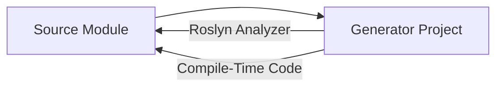

# Generator Projects

## Overview

The repository contains **12 Roslyn source generator projects**. All target `netstandard2.0` and are referenced as analyzers by their corresponding source projects.

## Generator List

| Generator | Module | Layer | Purpose |
|---|---|---|---|
| [[Alis.Generator]] | Alis | Application | Application-level code generation |
| [[Alis.Core.Generator]] | Alis.Core | Structuration | Core structuration generation |
| [[Alis.Core.Ecs.Generator]] | Alis.Core.Ecs | Operation | ECS component/system generation |
| [[Alis.Core.Audio.Generator]] | Alis.Core.Audio | Operation | Audio module code gen |
| [[Alis.Core.Graphic.Generator]] | Alis.Core.Graphic | Operation | Graphics module code gen |
| [[Alis.Core.Physic.Generator]] | Alis.Core.Physic | Operation | Physics module code gen |
| [[Alis.Core.Aspect.Data.Generator]] | Alis.Core.Aspect.Data | Ideation | Data serialization code gen |
| [[Alis.Core.Aspect.Fluent.Generator]] | Alis.Core.Aspect.Fluent | Ideation | Fluent API builder code gen |
| [[Alis.Core.Aspect.Logging.Generator]] | Alis.Core.Aspect.Logging | Ideation | Logging code gen |
| [[Alis.Core.Aspect.Math.Generator]] | Alis.Core.Aspect.Math | Ideation | Math code gen |
| [[Alis.Core.Aspect.Memory.Generator]] | Alis.Core.Aspect.Memory | Ideation | Memory management code gen |
| [[Alis.Core.Aspect.Time.Generator]] | Alis.Core.Aspect.Time | Ideation | Time-related code gen |

## Architecture

## Build Flow

1. Generator projects build to `netstandard2.0` DLLs
2. Source projects reference generators as `OutputItemType="Analyzer"` with `PrivateAssets="all"`
3. Generators produce additional `.cs` files at compile time
4. Generated code is AOT-safe (no runtime generation)

## Rules

- Must target `netstandard2.0` only
- Must produce deterministic output
- Must be AOT-compatible (no `Reflection.Emit`)
- Referenced via MSBuild wildcard patterns in `Config.props`
- Debug and Release configurations include appropriate generator references

## Release Build Integration

In Release mode, generator DLLs are:
1. Built and placed in `bin/Release/netstandard2.0/`
2. Copied to output as `analyzers/dotnet/cs/` 
3. Packed into NuGet package for distribution

## Related

- [[Source Generators]]
- [[Build System]]
- [[Projects Index]]
- [[Architecture Overview]]
