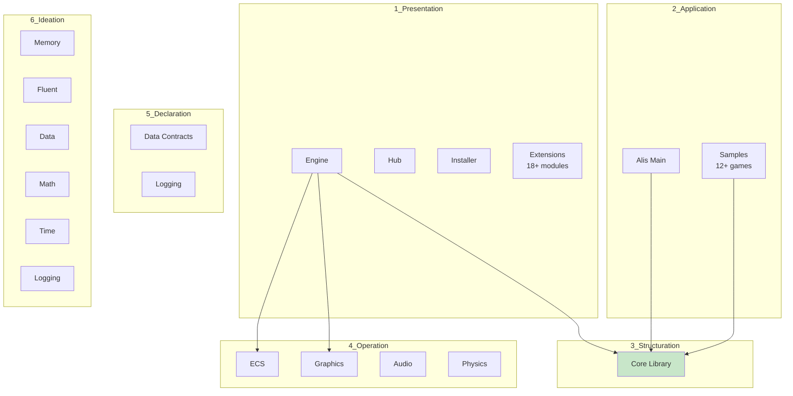
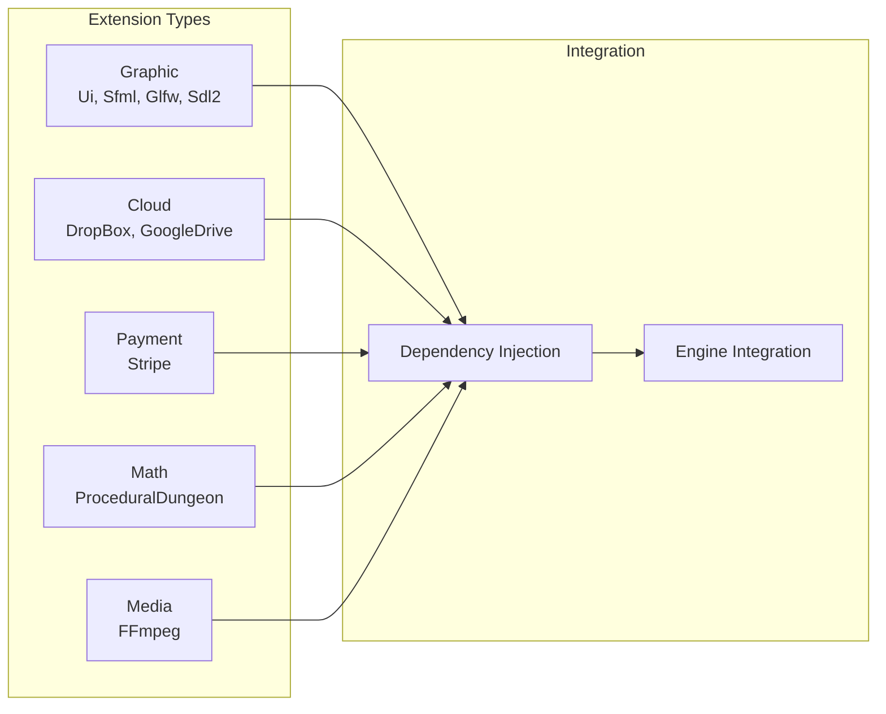

Mermaid diagrams illustrating project structure and relationships.

## Layer Structure

## Project Count by Layer

| Layer | Projects | Documentation Status |
|-------|----------|---------------------|
| 1_Presentation | 5+ | ✅ Complete |
| 2_Application | 1+ | ✅ Complete |
| 3_Structuration | 1 | ✅ Complete |
| 4_Operation | 4 | ✅ Complete |
| 5_Declaration | 1 | ✅ Complete |
| 6_Ideation | 6 | ✅ Complete |

## Extension Categories

## See Also
- [[Project Index]]
- [[Layered Architecture]]
