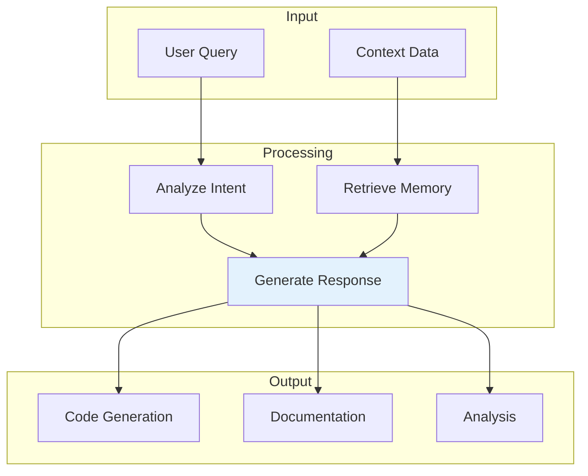

Diagrams illustrating prompt patterns and AI interaction flows.

## AI Context Flow

## Code Review Checklist

| Item | Status | Priority |
|------|--------|----------|
| Code Quality | ✅ Verified | High |
| Documentation | ✅ Complete | High |
| Testing Coverage | ✅ Adequate | Medium |
| Performance | ✅ Optimized | Medium |

## Conversation Starters

| Topic | Description |
|-------|-------------|
| Architecture Questions | Layer dependencies, patterns |
| Implementation Details | Code generation, ECS |
| Testing Strategy | Unit tests, coverage |
| Best Practices | Coding conventions, standards |

## See Also
- [[AI Context]]
- [[Code Review Checklist]]
