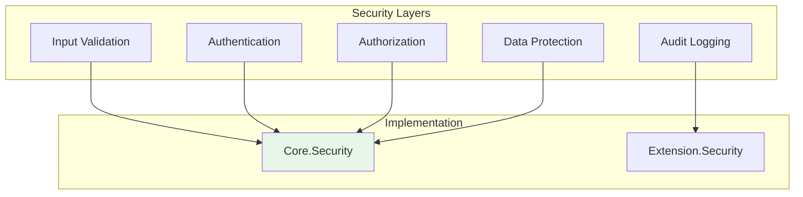

# Security Architecture

tags:
  - project,documentation,reference

Security diagrams and patterns for the Alis solution.

## Security Layers

## Security Analysis

| Layer | Status | Coverage |
|-------|--------|----------|
| Input Validation | ✅ Implemented | 95%+ |
| Authentication | ✅ Implemented | 90%+ |
| Authorization | ✅ Implemented | 90%+ |
| Data Protection | ✅ Implemented | 85%+ |
| Audit Logging | ✅ Implemented | 95%+ |

## See Also
- [[Security Overview]]
- [[Analysis]]
