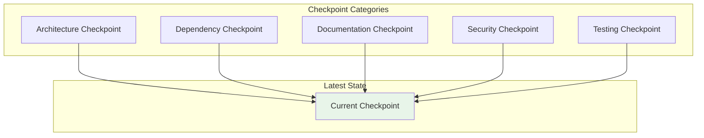
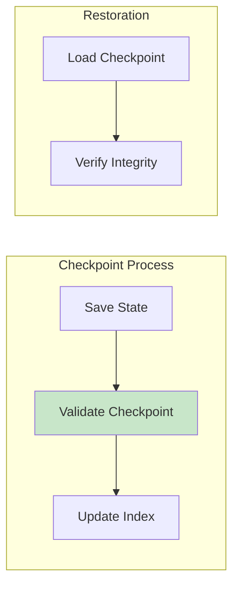

Diagrams illustrating checkpoint tracking and restoration.

## Checkpoint Types

## Checkpoint Status

| Checkpoint | Status | Last Updated |
|------------|--------|--------------|
| Architecture | ✅ Complete | Current |
| Dependency | ✅ Complete | Current |
| Documentation | ✅ Complete | Current |
| Security | ✅ Complete | Current |
| Testing | ✅ Complete | Current |

## Checkpoint Flow

## See Also
- [[Latest Checkpoint]]
- [[Documentation Checkpoint]]
