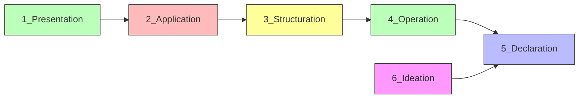
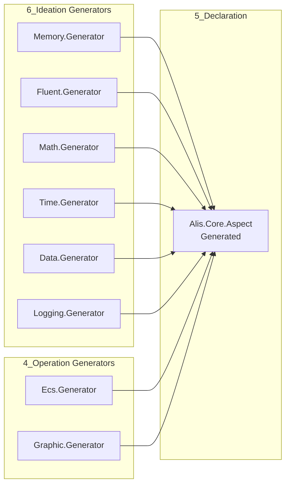

# Dependency Index — ALIS

## Dependency Flow (Strict)

```
1_Presentation → 2_Application → 3_Structuration → 4_Operation → 5_Declaration ← 6_Ideation
```

Upward references are **forbidden**. Source generators cascade **downward**.

---

## Layer Dependencies



---

## Project Reference Graph

### Debug Mode (Implicit References via Config.props)

The build system in `.config/Config.props` automatically adds project references based on layer:

| Layer | References |
|-------|-----------|
| 1_Presentation | All projects in 2_Application + all generators from 3_Structuration, 4_Operation, 5_Declaration, 6_Ideation |
| 2_Application | All src projects in 3_Structuration + all generators from 4_Operation, 5_Declaration, 6_Ideation |
| 3_Structuration | All src projects in 4_Operation + all generators from 5_Declaration, 6_Ideation |
| 4_Operation | All src projects in 5_Declaration + all generators from 6_Ideation |
| 5_Declaration | All src projects in 6_Ideation |
| 6_Ideation | None (leaf layer) |

### Release Mode (Compile-time Inlining)

In Release builds, source files from lower layers are **compiled directly** into higher layers via `<Compile Include>` directives:

- 2_Application includes source from 3_Structuration, 4_Operation, 5_Declaration, 6_Ideation
- 3_Structuration includes source from 4_Operation, 6_Ideation
- 4_Operation includes source from 5_Declaration, 6_Ideation
- 5_Declaration includes source from 6_Ideation

This produces **single assembly** output for each layer in Release mode.

---

## External NuGet Dependencies

### Conditional Dependencies (Config.props)

| Condition | Package | Version |
|-----------|---------|---------|
| net461–net481 | System.IO.Compression | 4.3.0 |
| net461–net481 | System.Net.Http | 4.3.0 |
| net461–net481 | System.Runtime.CompilerServices.Unsafe | 6.1.1 |
| net461–net481 | System.Memory | 4.6.2 |
| netcoreapp2.0–3.1 | System.Runtime.CompilerServices.Unsafe | 6.1.1 |
| netcoreapp2.0–3.1 | System.Memory | 4.6.2 |
| netstandard2.0–2.1 | System.Runtime.CompilerServices.Unsafe | 6.1.1 |
| netstandard2.0–2.1 | System.Memory | 4.6.2 |
| All | Microsoft.SourceLink.GitHub | 8.0.0 |

### Extension-Specific Dependencies

| Assembly | Package | Version |
|----------|---------|---------|
| Alis.Extension.Payment.Stripe | Stripe.net | 49.2.0 |
| Alis.Extension.Ads.GoogleAds | Google.Ads.Common | 9.5.3 |
| Alis.Extension.Cloud.GoogleDrive | Google.Apis.Drive.v3 | 1.68.0.3601 |
| Alis.Extension.Cloud.DropBox | Dropbox.Api | 7.0.0 |

---

## Generator Cascade



All generators target `netstandard2.0` and are referenced as `Analyzer` with `PrivateAssets=all` and `ReferenceOutputAssembly=false`.

---

## Platform Dependencies

| Extension | Platform | Native Binding |
|-----------|----------|---------------|
| Alis.Extension.Graphic.Sfml | Graphics | SFML native libs |
| Alis.Extension.Graphic.Glfw | Window/Input | GLFW native libs |
| Alis.Extension.Graphic.Sdl2 | Graphics/Audio | SDL2 native libs |
| Alis.Core.Audio | Audio | Platform-specific (aplay, mpg123, afplay) |

---

## Dependency Health

| Metric | Status |
|--------|--------|
| Layer Violations | None detected |
| Cyclic Dependencies | None (strict layering prevents this) |
| External NuGet Packages | 8 total |
| Generator Coupling | Via Roslyn analyzer references only |

---

## Related Documentation

- [[architecture/dependency-graph]] — Visual dependency maps
- [[architecture/repository-overview]] — Architecture overview
- [[system/indexes/layer-index]] — Layer breakdown
