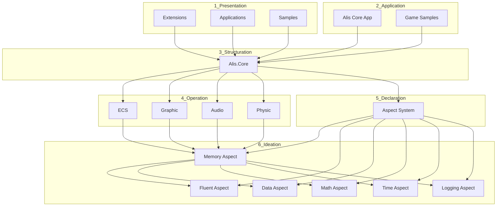

# Dependency Index

## Project Dependencies

### Core Dependencies

| Dependency | Projects | Purpose |
|---|---|---|
| Alis.Core | All projects | Base abstractions |
| System.Memory | ECS, Graphic | Span<T>, Memory<T> |
| System.Runtime.CompilerServices.Unsafe | ECS | Low-level memory ops |
| Alis.Core.Aspect.Memory | All Ideation aspects | Memory management and asset registry |

### Platform Dependencies

| Dependency | Projects | Purpose |
|---|---|---|
| SFML | Graphic | Cross-platform graphics |
| GLFW | Graphic | Window management |
| SDL2 | Graphic | Graphics/audio backend |
| OpenGL | Graphic, ECS | 3D rendering |

### Extension Dependencies

| Dependency | Projects | Purpose |
|---|---|---|
| Alis.Core.Aspect.Logging | ALL 19 extensions | Logging infrastructure |
| Alis.App.Core | Most extensions | Core application framework |
| Alis.Core.Ecs | Cloud.GoogleDrive | ECS manager integration |
| Alis.Core.Aspect.Math | Graphic extensions, Sdl2 | Vector types, transforms |
| Google.Apis.Drive.v3 | Cloud.GoogleDrive | Google Drive API |
| Google.Apis.Auth | Cloud.GoogleDrive | OAuth 2.0 authentication |
| Stripe.net | Payment.Stripe | Stripe payment API |
| Dropbox SDK | Cloud.DropBox | Dropbox cloud storage |
| ENet | Network | UDP networking library |
| FFmpeg | Media.FFmpeg | Multimedia processing CLI |
| cimgui | Graphic.Ui | ImGui native library |
| SFML | Graphic.Sfml | Simple and Fast Multimedia Library |
| GLFW | Graphic.Glfw | OpenGL window management |
| SDL2 | Graphic.Sdl2 | Simple DirectMedia Layer |
| System.Net.Http | Updater, Network | HTTP communication |
| System.IO.Compression | Updater, Memory | ZIP extraction

### Ideation Dependencies

| Dependency | Projects | Purpose |
|---|---|---|
| Alis.Core.Aspect.Memory | Memory, Fluent, Data, Math, Time, Logging | Cross-cutting aspects |
| System.Buffers | Memory | ArrayPool for memory management |
| System.IO.Compression | Memory | ZIP file handling |
| System.Security.Cryptography | Memory | SHA256 hash-based change detection |

## Dependency Graph

## Layer Violations

- None detected - Architecture well-separated

## Key Relationships

### Core to Operation
- **Alis.Core** → **ECS, Graphic, Audio, Physic**: Base abstractions for all operation systems

### Ideation to Core
- **All Ideation aspects** → **Alis.Core.Aspect.Memory**: Memory aspect provides asset registry and caching
- **Memory** → **System.Buffers, System.IO.Compression**: External dependencies for ZIP handling

### Platform Bindings
- **Graphic** → **SFML, GLFW, SDL2**: Cross-platform graphics backends
- **Audio** → **Platform-specific tools**: aplay, mpg123, afplay

## Documentation Coverage

| Layer | Projects | Documented | Pending |
|---|---|---|---|
| 1_Presentation | 23 | 23 | 0 |
| 2_Application | 14 | 1 (core) | 13 (samples need enrichment) |
| 3_Structuration | 5 | 5 | 0 |
| 4_Operation | 16 | 10 | 6 (sub-projects) |
| 5_Declaration | 1 | 1 | 0 |
| 6_Ideation | 24 | 24 | 0 |

## Next Steps

1. Enrich Application docs (Engine, Hub, Installer, Benchmark)
2. Enrich Sample project docs
3. Update dependency diagrams

## Related

- [[architecture/dependency-graph]] — Dependency map with Mermaid
- [[diagrams/dependency-graph]] — Visual dependency diagram
- [[diagrams/architecture-overview]] — Architecture diagrams
- [[layer-index]] — Layer dependency rules
- [[project-index]] — All project dependencies
- [[adr-001-layered-architecture]] — Layer rules decision
- [[indexes-summary]] — All indexes with all new extensions
