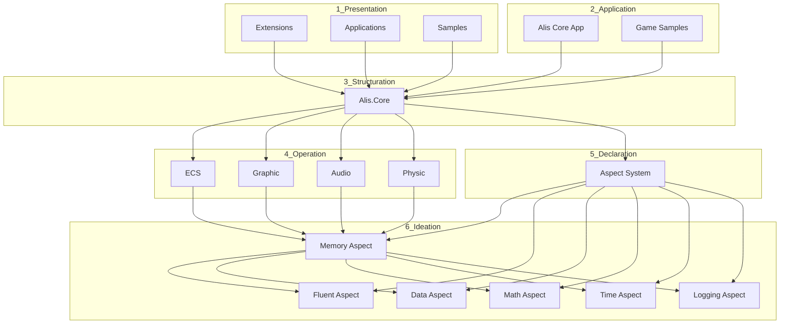

# Dependency Index

## Project Dependencies

### Core Dependencies

| Dependency | Projects | Purpose |
|---|---|---|
| Alis.Core | All projects | Base abstractions |
| System.Memory | ECS, Graphic | Span<T>, Memory<T> |
| System.Runtime.CompilerServices.Unsafe | ECS | Low-level memory ops |
| Alis.Core.Aspect.Memory | All Ideation aspects | Memory management and asset registry |

### Platform Dependencies

| Dependency | Projects | Purpose |
|---|---|---|
| SFML | Graphic | Cross-platform graphics |
| GLFW | Graphic | Window management |
| SDL2 | Graphic | Graphics/audio backend |
| OpenGL | Graphic, ECS | 3D rendering |

### Extension Dependencies

| Dependency | Projects | Purpose |
|---|---|---|
| Stripe SDK | Payment.Stripe | Payment processing |
| Dropbox SDK | Cloud.DropBox | Cloud storage |
| Google Drive API | Cloud.GoogleDrive | Cloud storage |

### Ideation Dependencies

| Dependency | Projects | Purpose |
|---|---|---|
| Alis.Core.Aspect.Memory | Memory, Fluent, Data, Math, Time, Logging | Cross-cutting aspects |
| System.Buffers | Memory | ArrayPool for memory management |
| System.IO.Compression | Memory | ZIP file handling |
| System.Security.Cryptography | Memory | SHA256 hash-based change detection |

## Dependency Graph

## Layer Violations

- None detected - Architecture well-separated

## Key Relationships

### Core to Operation
- **Alis.Core** → **ECS, Graphic, Audio, Physic**: Base abstractions for all operation systems

### Ideation to Core
- **All Ideation aspects** → **Alis.Core.Aspect.Memory**: Memory aspect provides asset registry and caching
- **Memory** → **System.Buffers, System.IO.Compression**: External dependencies for ZIP handling

### Platform Bindings
- **Graphic** → **SFML, GLFW, SDL2**: Cross-platform graphics backends
- **Audio** → **Platform-specific tools**: aplay, mpg123, afplay

## Documentation Coverage

| Layer | Projects | Documented | Pending |
|---|---|---|---|
| 1_Presentation | ~60 | 0 | 60 |
| 2_Application | ~40 | 0 | 40 |
| 3_Structuration | ~5 | 0 | 5 |
| 4_Operation | ~14 | 4 | 10 |
| 5_Declaration | ~3 | 0 | 3 |
| 6_Ideation | ~18 | 6 | 12 |

## Next Steps

1. Document Extensions (1_Presentation/Extension)
2. Document Applications and Samples
3. Update dependency diagrams
