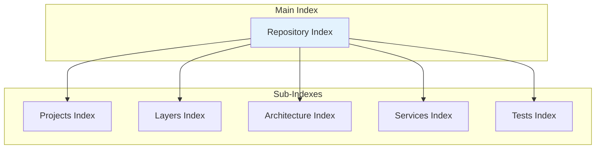
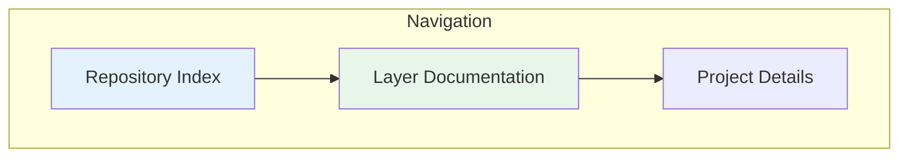

Diagrams illustrating repository indexing and navigation.

## Index Structure

## Index Coverage

| Index | Projects | Status |
|-------|----------|--------|
| Projects Index | 140+ | ✅ Complete |
| Layer Index | 6 layers | ✅ Complete |
| Architecture Index | All | ✅ Complete |
| Services Index | All layers | ✅ Complete |
| Tests Index | All tests | ✅ Complete |

## Navigation Flow

## See Also
- [[Repository Index]]
- [[Projects Index]]
