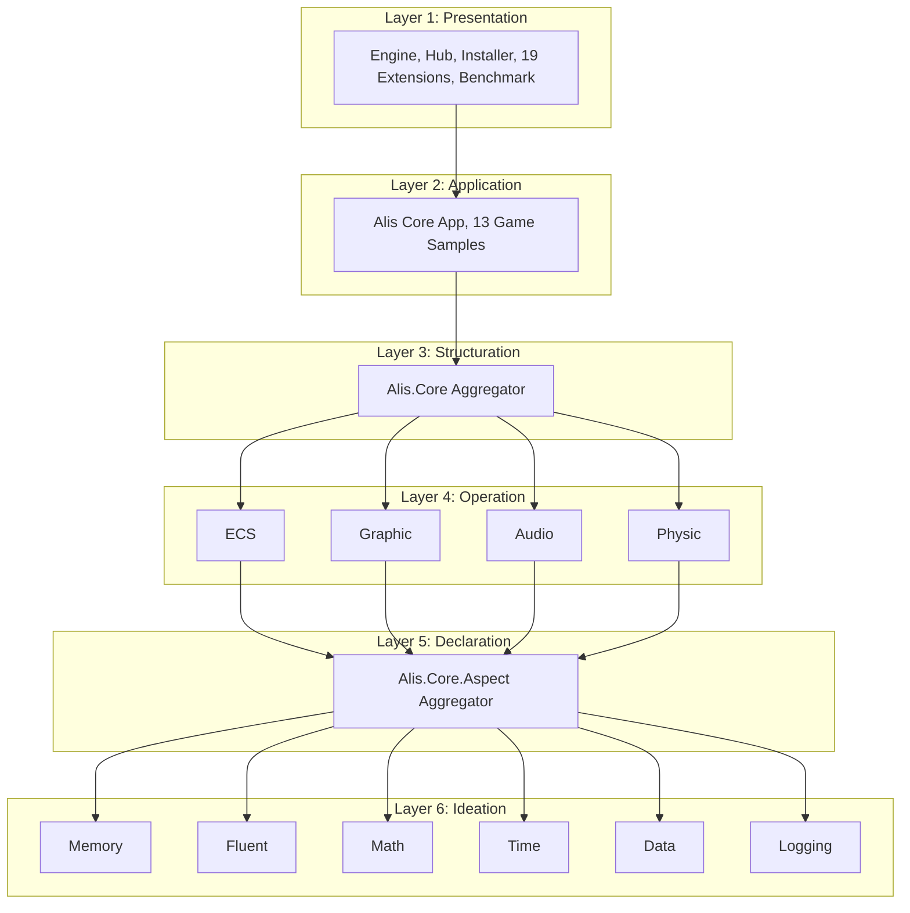

# Layer Index — ALIS

## Layer 1: Presentation (1_Presentation)

- **Purpose**: User-facing applications, extensions, and benchmarks
- **Project Count**: ~60
- **Dependencies**: References 2_Application; receives generators from 3–6
- **Key Projects**:
  - **Alis.App.Engine** — Main game engine/editor application
  - **Alis.App.Hub** — Project management hub
  - **Alis.App.Installer** — Installation wizard
  - **Alis.Benchmark** — Performance benchmarking
  - **19 Extensions** — Platform bindings, integrations, utilities

### Extension Categories

| Category | Extensions |
|----------|-----------|
| Graphics | Graphic.Ui, Graphic.Sfml, Graphic.Glfw, Graphic.Sdl2 |
| Cloud | Cloud.DropBox, Cloud.GoogleDrive |
| Language | Language.Translator, Language.Dialogue |
| Math | Math.ProceduralDungeon, Math.HighSpeedPriorityQueue |
| System | Updater, Profile, Thread |
| Payment | Payment.Stripe |
| Security | Security |
| Ads | Ads.GoogleAds |
| I/O | Io.FileDialog |
| Network | Network |
| Media | Media.FFmpeg |

---

## Layer 2: Application (2_Application)

- **Purpose**: Core application framework and game samples
- **Project Count**: ~30
- **Dependencies**: References 3_Structuration; receives generators from 3–6
- **Key Projects**:
  - **Alis** — Core application framework
  - **14 Game Samples** — Each with Desktop + Web targets (28 projects total)
  - **Special**: Asteroid has iOS and Android targets (4 platforms — most multi-platform sample)

---

## Layer 3: Structuration (3_Structuration)

- **Purpose**: Core engine aggregation (zero hand-written code)
- **Project Count**: 3
- **Dependencies**: References 4_Operation; receives generators from 4–6
- **Key Projects**:
  - **Alis.Core** — Aggregator that re-exports all 4_Operation types
  - **Alis.Core.Test** — Tests
  - **Alis.Core.Sample** — Usage examples

---

## Layer 4: Operation (4_Operation)

- **Purpose**: Core engine subsystems
- **Project Count**: 14 (4 subsystems × {src, test, sample} + 2 generators)
- **Dependencies**: References 5_Declaration; receives generators from 5–6
- **Key Subsystems**:

| Subsystem | Source Files | Description |
|-----------|-------------|-------------|
| **Ecs** | ~108 | Entity Component System — archetype-based, cache-optimized |
| **Graphic** | ~147 | Graphics rendering — shaders, textures, meshes, materials |
| **Audio** | ~7 | Cross-platform audio playback |
| **Physic** | ~194 | 2D physics engine — collisions, controllers, joints |

Each subsystem follows the `src/test/sample/Generator` project structure.

---

## Layer 5: Declaration (5_Declaration)

- **Purpose**: Aspect system aggregation (zero hand-written code)
- **Project Count**: 3
- **Dependencies**: References 6_Ideation; receives generators from 6
- **Key Projects**:
  - **Alis.Core.Aspect** — Aggregator that re-exports all 6_Ideation types
  - **Alis.Core.Aspect.Test** — Tests
  - **Alis.Core.Aspect.Sample** — Usage examples

---

## Layer 6: Ideation (6_Ideation)

- **Purpose**: Aspect definitions with source generators
- **Project Count**: ~24 (6 aspects × {src, test, sample} + 4 generators)
- **Dependencies**: None (leaf layer)
- **Key Aspects**:

| Aspect | Source Files | Purpose |
|--------|-------------|---------|
| **Memory** | ~3 | ZIP-based asset management with dual-cache (in-memory + disk) |
| **Fluent** | ~128 | Fluent builder API with 120+ marker interfaces |
| **Data** | ~18 | Custom JSON parser (AOT-compatible) |
| **Math** | ~29 | Value-type vectors, matrices, shapes (zero GC) |
| **Time** | ~1 | High-resolution clock |
| **Logging** | ~24 | Structured logging with pluggable pipeline |

---

## Cross-Layer Relationships

---

## Related Documentation

- [[system/indexes/projects-index]] — Complete project inventory
- [[system/indexes/dependency-index]] — Dependencies
- [[architecture/repository-overview]] — Architecture overview
