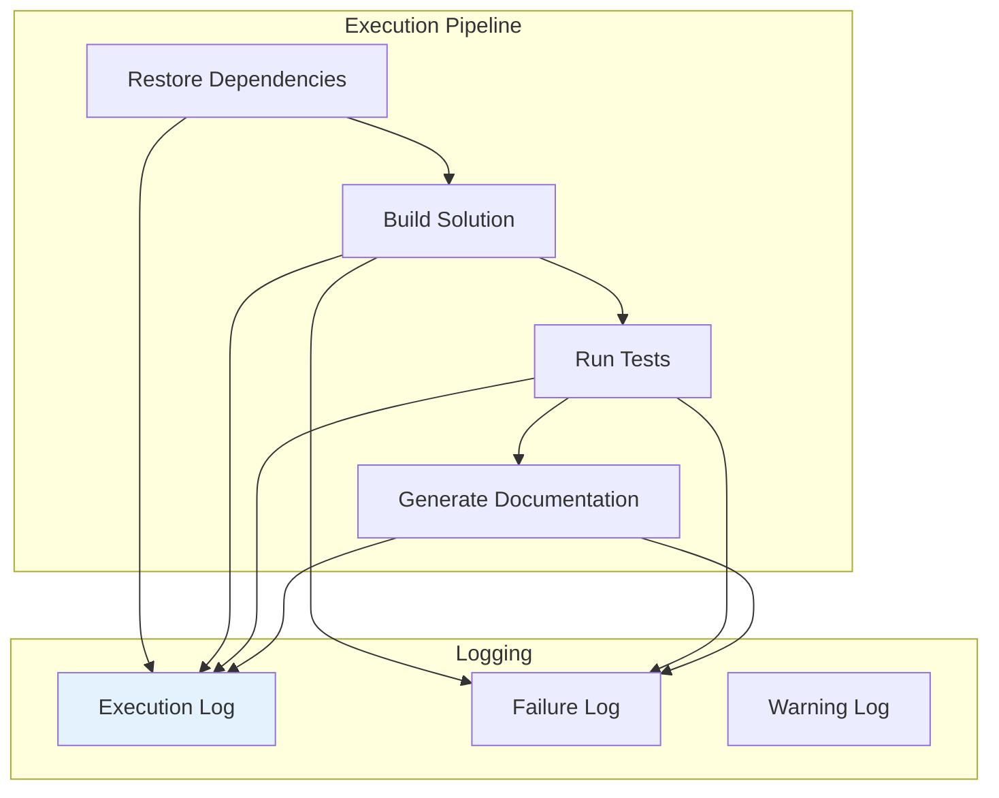
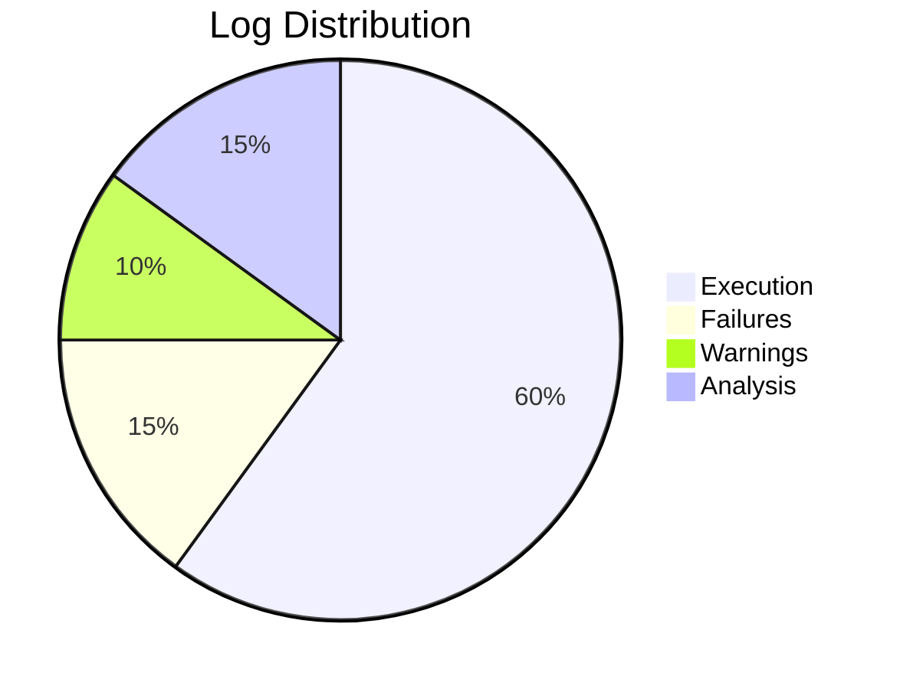

Diagrams illustrating logging and monitoring systems.

## Execution Flow

## Log Categories

| Log Type | Purpose | Status |
|----------|---------|--------|
| Execution Log | Track all operations | ✅ Active |
| Failure Log | Record errors | ✅ Monitored |
| Warning Log | Track warnings | ✅ Monitored |
| Analysis History | Document analysis | ✅ Archived |

## Monitoring Dashboard

## See Also
- [[Execution Log]]
- [[Failures]]
