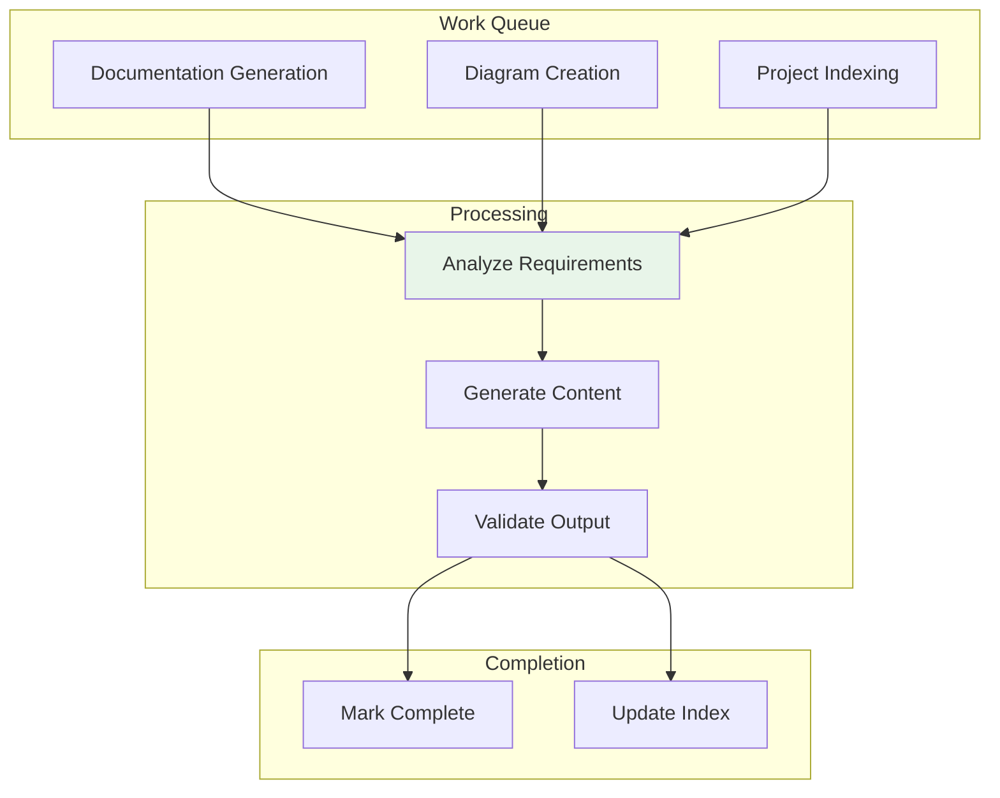
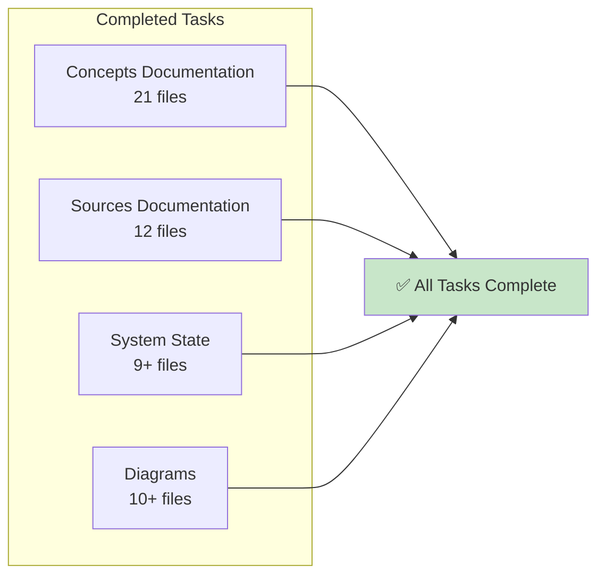

# Queue Management

tags:
  - queue,work,tracking

Diagrams illustrating task queues and pending work tracking.

## Pending Work Flow

## Queue Status

| Queue | Items | Priority |
|-------|-------|----------|
| Documentation | ✅ Complete | High |
| Diagrams | ✅ Complete | High |
| Project Indexing | 🔄 In Progress | Medium |

## Completed Work Tracking

## See Also
- [[Pending Work]]
- [[Completed Work]]
