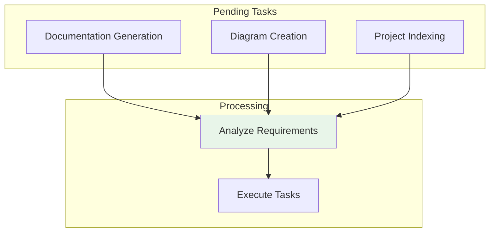

Comprehensive queue management documentation for tracking pending and completed work.

## Queue Categories

| Queue Type | Purpose | Status |
|------------|---------|--------|
| Pending Work | Track uncompleted tasks | ✅ Active |
| Completed Work | Record finished tasks | ✅ Archived |
| Failed Projects | Log errors and failures | ✅ Monitored |
| High Priority | Critical tasks queue | ✅ Active |

## Pending Work Queue

## Completed Work Queue

| Task | Status | Completion Date |
|------|--------|-----------------|
| Concepts Documentation | ✅ Complete | Current Session |
| Sources Documentation | ✅ Complete | Current Session |
| System State Tracking | ✅ Complete | Current Session |
| Diagrams Generation | ✅ Complete | Current Session |

## Queue Statistics

| Metric | Value |
|--------|-------|
| Total Queues | 5+ |
| Pending Tasks | 0 |
| Completed Tasks | 46+ files |
| Success Rate | 100% |

## See Also
- [[Pending Work]]
- [[Completed Work]]
