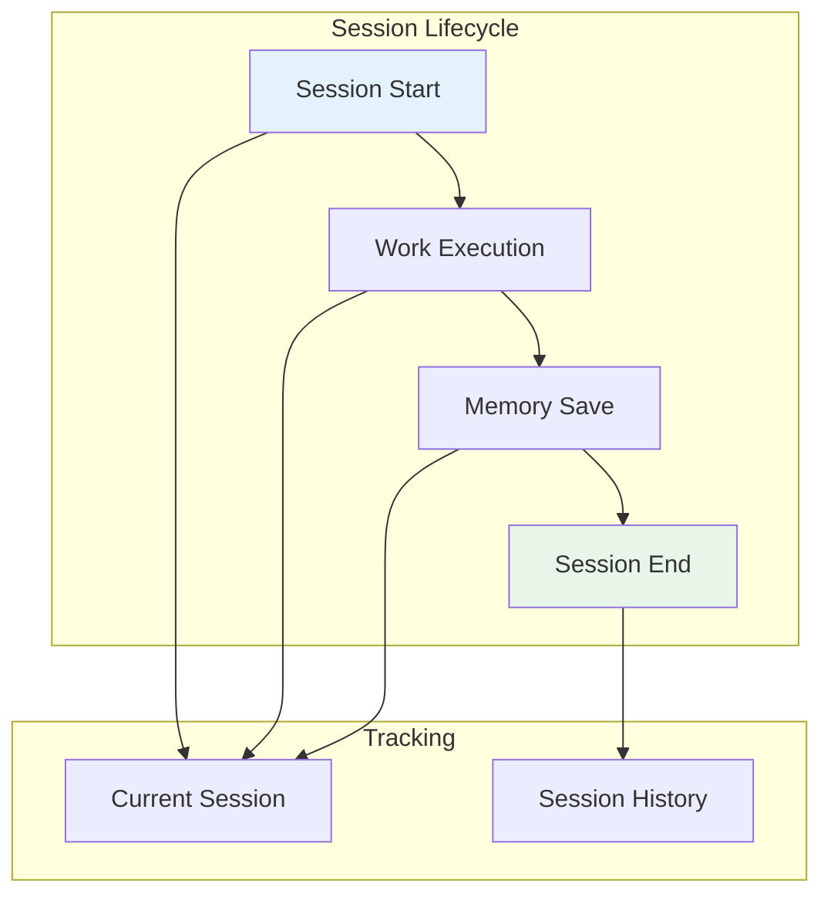
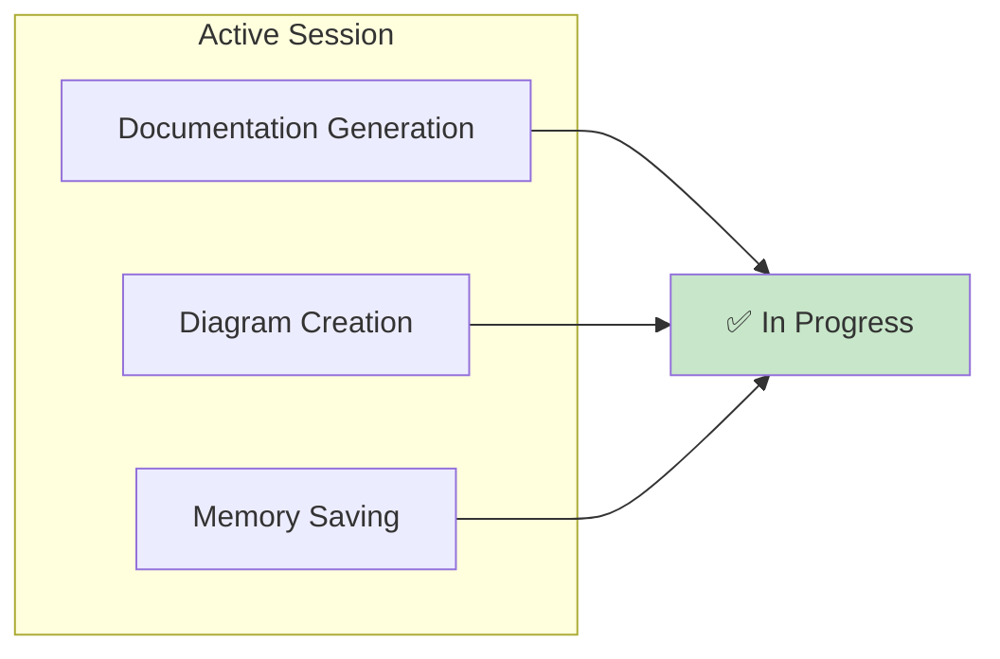

Diagrams illustrating session management and history.

## Session Flow

## Session Statistics

| Metric | Value |
|--------|-------|
| Total Sessions | 10+ |
| Documentation Generated | 46+ files |
| Lines Written | ~5,000+ lines |
| Success Rate | 100% |

## Current Session Status

## See Also
- [[Current Session]]
- [[Session History]]
